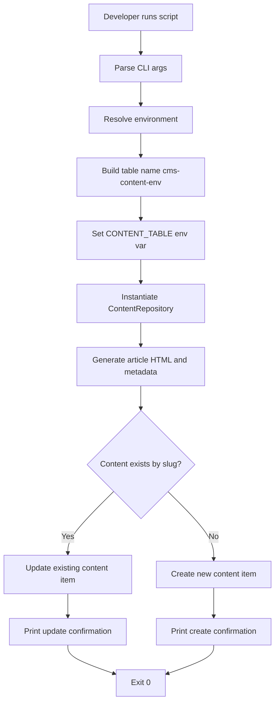
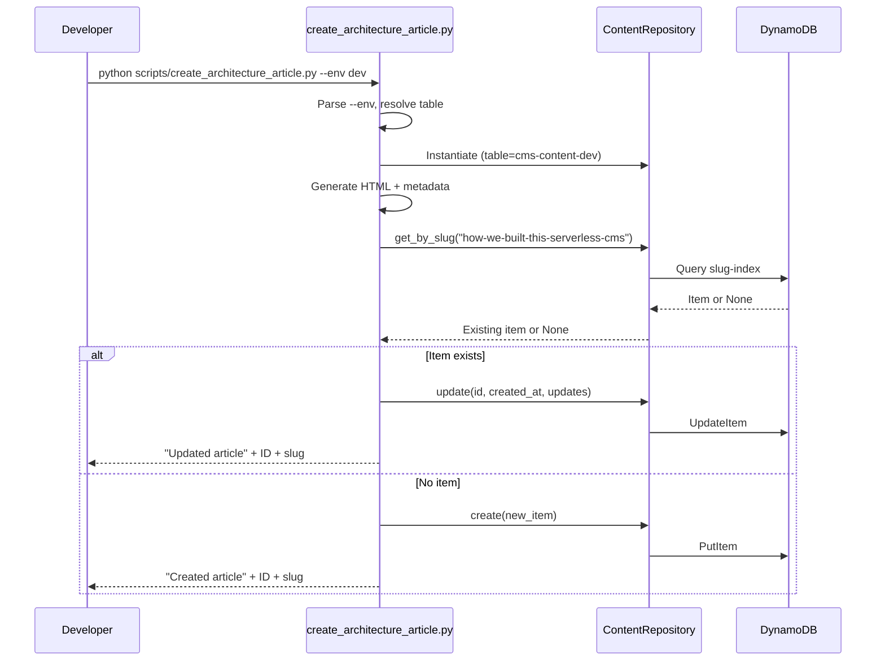
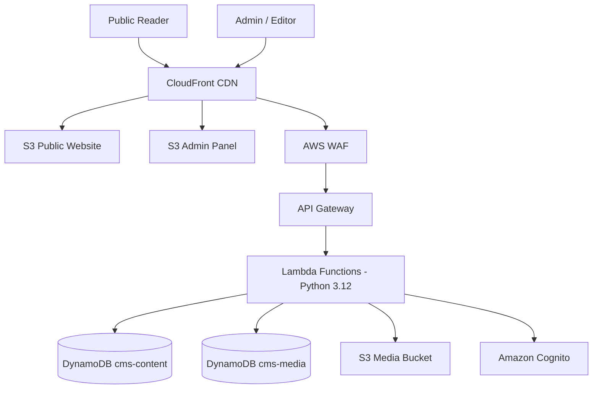
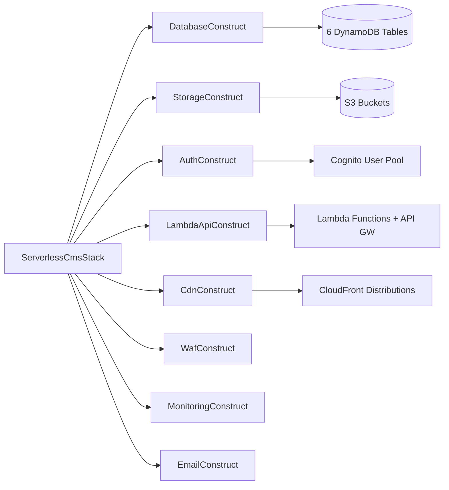
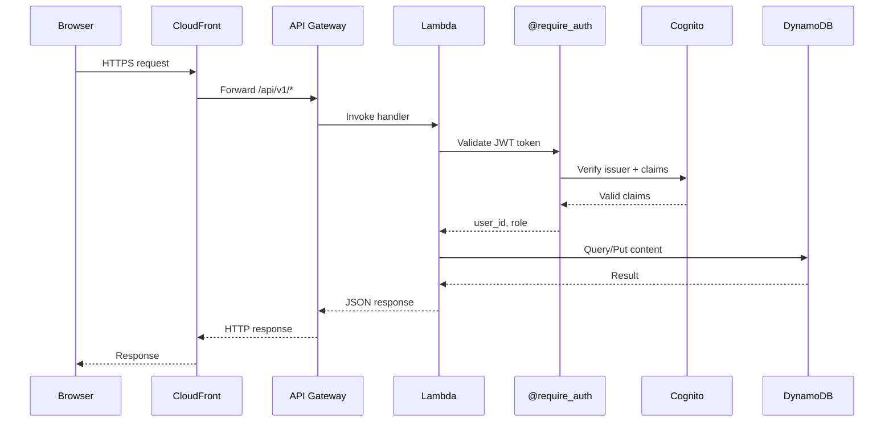
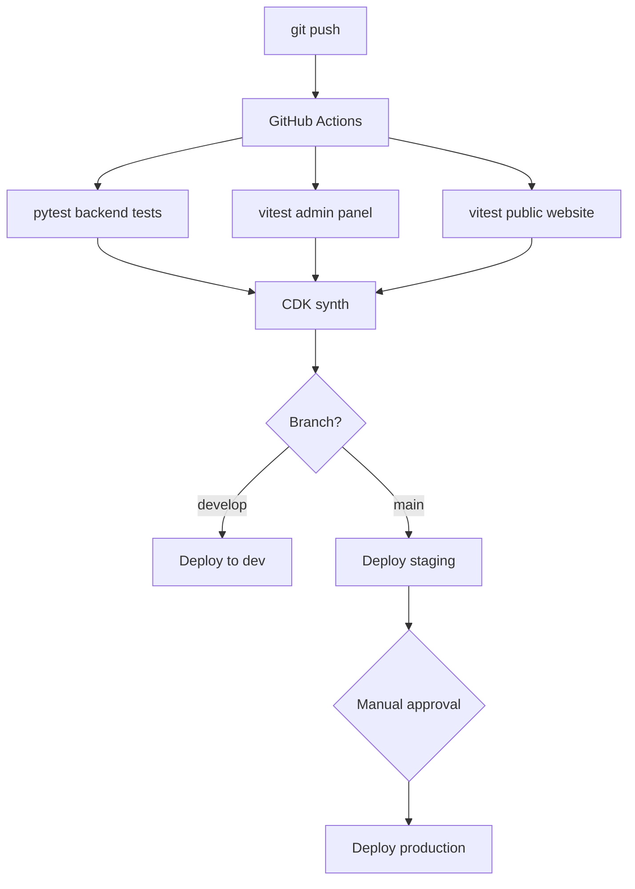
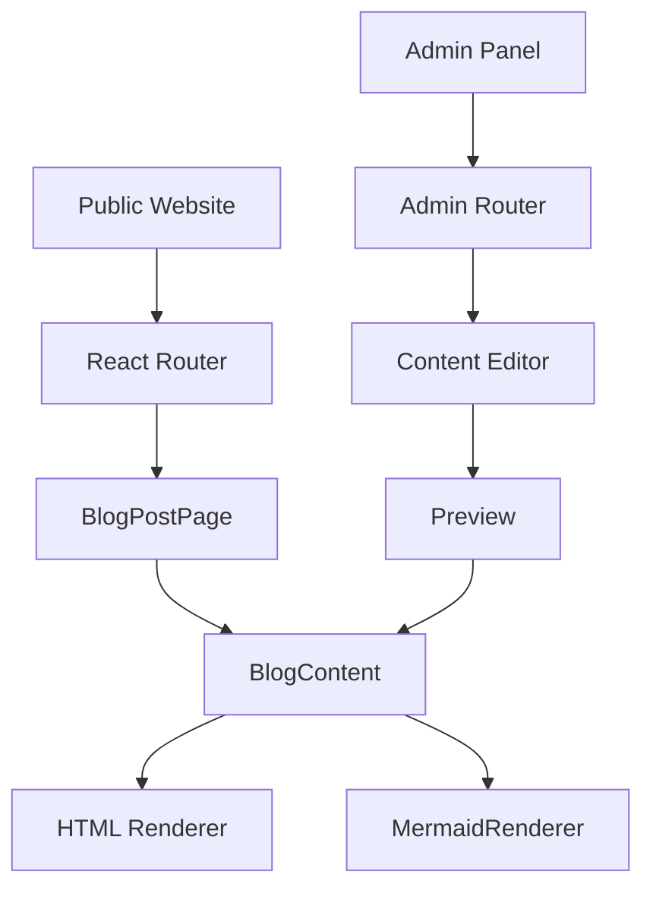
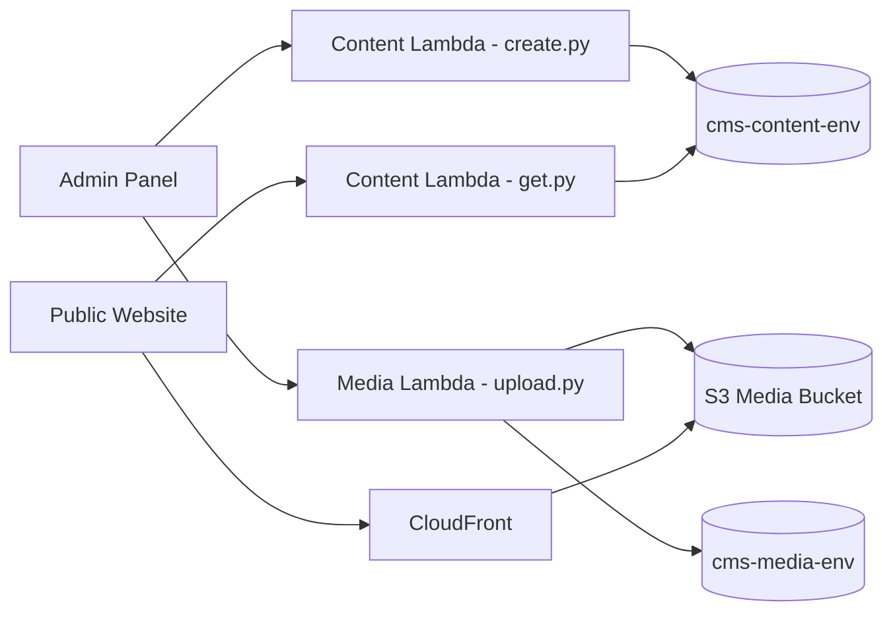

# Design: architecture-article

## Overview

The `architecture-article` feature adds a Python 3.12 script that creates or updates a comprehensive technical blog post describing the architecture of the serverless CMS hosted at `serverless.celestium.life` (GitHub: `celesrenata/serverless-cms`).

The script lives at:

```
scripts/create_architecture_article.py
```

Its responsibility is to generate a published CMS content item with the slug `how-we-built-this-serverless-cms` in the DynamoDB content table `cms-content-{env}` (defaulting to `cms-content-dev`).

The article content is stored as HTML in DynamoDB, following existing CMS rendering conventions:
- Standard content is HTML
- Mermaid diagrams embedded as `<pre><code class="language-mermaid">...</code></pre>`
- Code examples embedded as `<pre><code class="language-{lang}">...</code></pre>`

This format is required so that the `BlogContent` component splits content into HTML and Mermaid segments, and the `MermaidRenderer` component renders diagram blocks.

The script is idempotent: running it multiple times updates the existing content item rather than creating duplicates.

---

## Architecture

### Script Execution Flow



### Script Algorithm

1. Parse command-line arguments using `argparse` (`--env` defaulting to `dev`).
2. Resolve target table: `cms-content-{env}`.
3. Set `CONTENT_TABLE` environment variable so `ContentRepository` picks up the correct table.
4. Add `lambda/` to `sys.path` and instantiate `ContentRepository`.
5. Generate the article HTML content and metadata.
6. Call `repository.get_by_slug("how-we-built-this-serverless-cms")`.
7. If item exists: preserve `id` and `created_at`, update content/metadata/timestamps via `repository.update()`.
8. If no item exists: generate new UUID, set all fields, call `repository.create()`.
9. Print confirmation (action, environment, table, ID, slug) to stdout.
10. On any DynamoDB error: print descriptive error, exit with non-zero status.

### Upsert Sequence



### Article Structure

The article covers 13 topic areas with 6 Mermaid diagrams and 4+ code examples. The heading outline:

```
h1: How We Built This Serverless CMS
  h2: Introduction
  h2: The Big Picture: System Architecture
  h2: Infrastructure as Code with AWS CDK
    h3: CDK Construct Boundaries
    h3: Deployment Flow
  h2: Serverless Backend Architecture
    h3: Lambda Function Organization
    h3: Authenticated APIs with @require_auth
    h3: DynamoDB Access Patterns
  h2: Frontend Architecture
    h3: Public Website
    h3: Admin Panel
    h3: Mermaid Diagram Rendering
    h3: Dark Theme Support
  h2: Authentication and Authorization
  h2: Media Handling and CDN Delivery
  h2: Content Features
    h3: Comment System and Moderation
    h3: Gallery Album Experience
    h3: Plugin System
  h2: Operations and Quality
    h3: WordPress Migration
    h3: Property-Based Testing with Hypothesis
    h3: Backup and Restore
  h2: CI/CD Pipeline
  h2: Lessons Learned and Conclusion
```

---

## Components and Interfaces

### Script Location and Invocation

```
scripts/create_architecture_article.py
```

```bash
# Default (dev)
python scripts/create_architecture_article.py

# Explicit environment
python scripts/create_architecture_article.py --env prod
```

### CLI Interface

| Argument | Required | Default | Description |
|----------|----------|---------|-------------|
| `--env`  | No       | `dev`   | Target environment. Determines DynamoDB table name. |

### Table Name Resolution

```python
table_name = f"cms-content-{args.env}"
```

| CLI Input | Table Name |
|-----------|------------|
| (omitted) | `cms-content-dev` |
| `--env dev` | `cms-content-dev` |
| `--env staging` | `cms-content-staging` |
| `--env prod` | `cms-content-prod` |

### Repository Integration

The script imports `ContentRepository` from `lambda/shared/db.py` by adding the Lambda directory to `sys.path`:

```python
import sys
from pathlib import Path

ROOT_DIR = Path(__file__).resolve().parents[1]
sys.path.insert(0, str(ROOT_DIR / "lambda"))

from shared.db import ContentRepository
```

Required repository methods:
- `get_by_slug(slug: str) -> Optional[Dict]` — lookup by slug-index GSI
- `create(item: Dict) -> Dict` — PutItem
- `update(content_id: str, created_at: int, updates: Dict) -> Dict` — UpdateItem

### Script Internal Structure

```python
SLUG = "how-we-built-this-serverless-cms"

def parse_args() -> argparse.Namespace: ...
def build_article_content() -> str: ...
def build_metadata() -> dict: ...
def upsert_article(repo: ContentRepository) -> None: ...
def main() -> None: ...
```

---

## Data Models

### Content Item Schema

The content table uses partition key `id` (String) and sort key `created_at` (Number).

Generated item structure:

```json
{
  "id": "4a25cc7a-f6c4-4b67-b7db-76c6bbcc93d7",
  "created_at": 1751900400,
  "updated_at": 1751900400,
  "published_at": 1751900400,
  "type": "post",
  "type#timestamp": "post#1751900400",
  "title": "How We Built This Serverless CMS",
  "slug": "how-we-built-this-serverless-cms",
  "content": "<h1>How We Built This Serverless CMS</h1>...",
  "excerpt": "A technical deep dive into the serverless architecture behind serverless.celestium.life...",
  "author": "",
  "status": "published",
  "featured_image": "",
  "metadata": {
    "seo_title": "How We Built This Serverless CMS | Celestium",
    "seo_description": "A technical deep dive into the AWS CDK, Lambda, DynamoDB, Cognito, React, and CI/CD architecture behind serverless.celestium.life.",
    "tags": ["serverless", "aws", "cdk", "lambda", "dynamodb", "react", "typescript", "architecture", "cognito", "ci-cd"],
    "canonical_url": "https://serverless.celestium.life/blog/how-we-built-this-serverless-cms",
    "repository": "https://github.com/celesrenata/serverless-cms"
  }
}
```

All timestamps are Unix epoch seconds (integers), consistent with the project convention of `int(time.time())`.

### HTML Content Structure

The `content` field stores the full article as HTML. Mermaid diagrams and code examples are embedded inline.

**Mermaid block format** (required by MermaidRenderer):
```html
<pre><code class="language-mermaid">flowchart TD
    A --> B
</code></pre>
```

**Code block format** (for syntax highlighting):
```html
<pre><code class="language-python">@require_auth(roles=["admin"])
def handler(event, context):
    ...
</code></pre>
```

Code content must be HTML-escaped (using `html.escape()`) to prevent invalid HTML from generics, JSX, or angle brackets.

### Article Mermaid Diagrams

The article includes exactly 6 mermaid diagrams:

#### Diagram 1: System Architecture



#### Diagram 2: CDK Construct Tree



#### Diagram 3: Request Lifecycle Sequence



#### Diagram 4: CI/CD Pipeline



#### Diagram 5: Frontend Component Architecture



#### Diagram 6: Content Data Flow



### Code Examples Included in Article

#### CDK Construct Composition (TypeScript)

```typescript
const database = new DatabaseConstruct(this, 'Database', { environment });
const storage = new StorageConstruct(this, 'Storage', { environment });
const auth = new AuthConstruct(this, 'Auth', { environment });

const lambdaApi = new LambdaApiConstruct(this, 'LambdaApi', {
  environment,
  contentTable: database.contentTable,
  mediaTable: database.mediaTable,
  mediaBucket: storage.mediaBucket,
  userPool: auth.userPool,
});

const cdn = new CdnConstruct(this, 'Cdn', {
  environment,
  api: lambdaApi.api,
  publicBucket: storage.publicBucket,
  adminBucket: storage.adminBucket,
});
```

#### Lambda Handler with @require_auth (Python)

```python
from shared.auth import require_auth
from shared.db import ContentRepository

content_repo = ContentRepository()

@require_auth(roles=['admin', 'editor', 'author'])
def handler(event, context, user_id, role):
    body = json.loads(event.get('body') or '{}')
    item = {
        'id': str(uuid.uuid4()),
        'type': 'post',
        'title': body['title'],
        'slug': body['slug'],
        'content': body['content'],
        'status': 'draft',
        'author': user_id,
        'created_at': int(time.time()),
        'updated_at': int(time.time()),
    }
    result = content_repo.create(item)
    return {'statusCode': 201, 'body': json.dumps(result)}
```

#### React BlogContent Component (TSX)

```tsx
export const BlogContent = ({ html }: { html: string }) => {
  const segments = useMemo(() => {
    // Split HTML into html and mermaid segments
    const mermaidRegex = /<pre><code class="language-mermaid">([\s\S]*?)<\/code><\/pre>/gi;
    // ... parsing logic
    return result;
  }, [html]);

  return (
    <>
      {segments.map((segment, index) =>
        segment.type === 'mermaid'
          ? <MermaidRenderer key={index} chart={segment.content} />
          : <div key={index} dangerouslySetInnerHTML={{ __html: segment.content }} />
      )}
    </>
  );
};
```

#### DynamoDB Upsert Pattern (Python)

```python
existing = repo.get_by_slug("how-we-built-this-serverless-cms")
now = int(time.time())

if existing:
    repo.update(existing['id'], existing['created_at'], {
        'title': title,
        'content': html_content,
        'metadata': metadata,
        'status': 'published',
        'published_at': existing.get('published_at', now),
        'updated_at': now,
    })
else:
    repo.create({
        'id': str(uuid.uuid4()),
        'type': 'post',
        'type#timestamp': f'post#{now}',
        'title': title,
        'slug': 'how-we-built-this-serverless-cms',
        'content': html_content,
        'status': 'published',
        'metadata': metadata,
        'created_at': now,
        'updated_at': now,
        'published_at': now,
    })
```

---

## Correctness Properties

*A property is a characteristic or behavior that should hold true across all valid executions of a system — essentially, a formal statement about what the system should do. Properties serve as the bridge between human-readable specifications and machine-verifiable correctness guarantees.*

### Property 1: Content Item Structural Validity

*For any* execution of the Article_Script, the resulting Content_Item SHALL contain all required fields: `id` (valid UUID), `slug` equal to `how-we-built-this-serverless-cms`, non-empty `title`, non-empty `content`, `type` equal to `post`, and a `metadata` object containing `seo_title`, `seo_description`, and `tags`.

**Validates: Requirements 1.1, 6.4**

### Property 2: Script Idempotency

*For any* number of sequential executions of the Article_Script against the same database, there SHALL be exactly one Content_Item with slug `how-we-built-this-serverless-cms`.

**Validates: Requirements 1.3**

### Property 3: Mermaid Block Format Consistency

*For any* mermaid diagram block in the article HTML content, it SHALL be wrapped in `<pre><code class="language-mermaid">...</code></pre>` format so that the existing MermaidRenderer component can parse and render it.

**Validates: Requirements 4.7**

### Property 4: Code Block Language Annotation

*For any* code example block in the article HTML content, it SHALL include a language identifier class (e.g., `language-typescript`, `language-python`) for syntax highlighting.

**Validates: Requirements 5.5**

### Property 5: Heading Hierarchy Validity

*For any* sequence of headings in the article HTML, the hierarchy SHALL be logically ordered with exactly one `h1`, `h2` for major sections, and `h3` for subsections, with no level skipping (e.g., no `h1` directly followed by `h3`).

**Validates: Requirements 6.1**

### Property 6: Environment Targeting

*For any* valid environment name passed via the `--env` argument, the Article_Script SHALL target the DynamoDB table `cms-content-{env}`, defaulting to `cms-content-dev` when no argument is provided.

**Validates: Requirements 7.3**

---

## Error Handling

### Argument Validation

If `--env` is provided as empty or contains invalid characters, the script prints an error and exits with status code 1 before attempting any DynamoDB operations.

### AWS Credential Errors

If boto3 cannot authenticate (`NoCredentialsError`, `PartialCredentialsError`), the script prints a user-friendly message including the target table name and exits with status code 1.

### Table Not Found

If DynamoDB raises `ResourceNotFoundException`, the script prints the resolved table name and suggests deploying the CDK stack for that environment. Exit code 1.

### Repository Operation Failures

If `ContentRepository.get_by_slug()`, `create()`, or `update()` raises an exception, the script catches it at the top level, prints context (environment, table, slug, error reason), and exits with status code 1.

### Confirmation Output

On success, the script prints to stdout:

```
{Created|Updated} architecture article.
Environment: {env}
Table: cms-content-{env}
ID: {uuid}
Slug: how-we-built-this-serverless-cms
```

---

## Testing Strategy

### Unit Tests (pytest)

Test file: `tests/scripts/test_create_architecture_article.py`

**Example-based tests:**
- Default environment resolves to `cms-content-dev`
- Explicit `--env prod` resolves to `cms-content-prod`
- `build_metadata()` returns object with `seo_title`, `seo_description`, non-empty `tags`
- `build_article_content()` returns non-empty HTML containing key terms (CDK, Lambda, DynamoDB, etc.)
- Script prints content ID and slug on successful create (mock repository)
- Script exits non-zero on DynamoDB write failure (mock repository raising exception)

### Content Validation Tests

Parse generated HTML with BeautifulSoup:
- Exactly one `<h1>` element
- Heading hierarchy follows valid ordering (no level skipping)
- Exactly 6 `<pre><code class="language-mermaid">` blocks with non-empty content
- All `<pre><code>` blocks have a `language-*` class
- Article contains expected section keywords for all 13 topic areas
- References to `serverless.celestium.life` and `celesrenata/serverless-cms` are present

### Repository Interaction Tests (mocked)

- When `get_by_slug` returns None → `create()` called, `update()` not called
- When `get_by_slug` returns existing item → `update()` called, `create()` not called
- Existing `id` and `created_at` are preserved on update
- Created item has valid UUID `id`, correct `slug`, `type='post'`, `status='published'`

### Property-Based Tests (Hypothesis)

**Property 6 — Environment targeting:**
```python
@given(st.from_regex(r"[a-zA-Z0-9_-]+", fullmatch=True))
def test_table_name_resolution(env):
    assert get_content_table_name(env) == f"cms-content-{env}"
```

**Property 5 — Heading hierarchy validator:**
Test the heading validation function with generated heading sequences to ensure it correctly accepts valid hierarchies and rejects invalid ones.

**Property 2 — Idempotency (integration with moto):**
Run the upsert logic twice against a moto-mocked DynamoDB table and assert exactly one item exists with the target slug.

### Integration Tests (moto)

Use `moto` to mock DynamoDB:
1. Run script once → verify 1 item with correct slug exists
2. Run script again → verify still exactly 1 item, `id` preserved, `updated_at` refreshed

### Test Configuration

- Property tests: minimum 100 iterations per property
- Each property test tagged: `Feature: architecture-article, Property {N}: {description}`
- Tests run as part of existing `pytest tests/ -v` backend test suite
- Script execution against real DynamoDB is manual only (not in CI)
