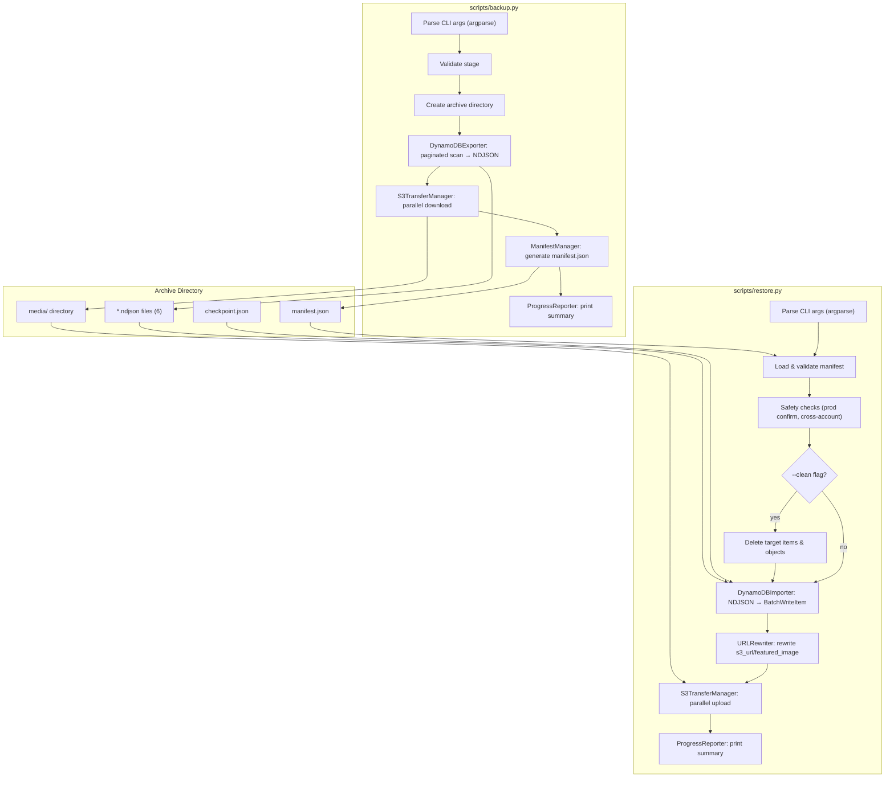

# Design Document: Backup and Restore

## Overview

The backup-restore feature provides full-fidelity export and import capabilities for the Serverless CMS deployed in AWS region `us-west-2`. Implemented as two Python 3.12 CLI scripts (`scripts/backup.py` and `scripts/restore.py`), the feature uses `boto3` for all AWS interactions.

The feature covers:
- **6 DynamoDB tables per stage**: `cms-content-{env}`, `cms-media-{env}`, `cms-users-{env}`, `cms-settings-{env}`, `cms-comments-{env}`, `cms-plugins-{env}`
- **1 S3 media bucket per stage**: `serverless-cms-media-{env}-776053071238`
- **3 environments**: `dev`, `staging`, `prod`

### Archive Format

A backup archive is a timestamped directory with this structure:

```
backup-{stage}-{YYYYMMDD-HHMMSS}/
├── manifest.json
├── checkpoint.json          (created during operation, tracks resume state)
├── errors.json              (created if errors occur)
├── cms-content-{env}.ndjson
├── cms-media-{env}.ndjson
├── cms-users-{env}.ndjson
├── cms-settings-{env}.ndjson
├── cms-comments-{env}.ndjson
├── cms-plugins-{env}.ndjson
└── media/
    └── ... (files mirroring S3 object keys)
```

### Design Decisions

| Decision | Rationale |
|---|---|
| NDJSON (one JSON object per line) | Streamable, no memory accumulation, easy line counting for validation |
| DynamoDB JSON format (typed attributes) | Preserves all DynamoDB type information (S, N, BOOL, L, M, SS, NS, BS, NULL) |
| `ThreadPoolExecutor` for S3 parallelism | stdlib, no extra dependency, configurable concurrency |
| `boto3.s3.transfer.TransferConfig` for multipart | Handles large objects (>100MB) without custom chunking code |
| Checkpoint file with atomic writes | Enables resume without risk of partial/corrupt state |
| Regex-based URL rewriting | Handles all S3 URL styles (virtual-hosted, path-style, s3://) |

---

## Architecture



### Backup Flow

1. Parse CLI arguments (`--stage` required, `--output-dir`, `--output-s3`, `--dry-run`, `--resume`, `--concurrency`, `--region`)
2. Validate stage is one of `dev`, `staging`, `prod`
3. Create archive directory: `backup-{stage}-{YYYYMMDD-HHMMSS}`
4. For each of the 6 DynamoDB tables:
   - Paginated scan using `LastEvaluatedKey`
   - Write each item as one JSON line in DynamoDB JSON format
   - Update checkpoint after each table completes
5. List all S3 objects in the source media bucket
6. Download objects in parallel using `ThreadPoolExecutor(max_workers=concurrency)`
7. Use `TransferConfig(multipart_threshold=100*1024*1024)` for large files
8. Generate `manifest.json` with counts, sizes, timestamps
9. Print completion summary

### Restore Flow

1. Parse CLI arguments (`--archive` required, `--target-stage` required, `--clean`, `--force`, `--dry-run`, `--resume`, `--concurrency`, `--region`)
2. Load and validate `manifest.json` from the archive
3. Safety checks:
   - If `--target-stage prod`: prompt "Type 'yes-restore-prod' to confirm"
   - If `--clean` and `--target-stage prod`: also require `--force` flag
   - If manifest account differs from current: warn and require `--force`
4. If `--clean`: delete all items in target tables + empty target bucket
5. For each NDJSON file:
   - Read items line by line (streaming, not loading entire file)
   - Apply URL rewriting if source stage ≠ target stage
   - Write using `BatchWriteItem` (batches of 25)
   - Retry `UnprocessedItems` with exponential backoff
6. Upload media files in parallel to target bucket
7. Update checkpoint, print summary

---

## Components and Interfaces

### Component Overview

| Component | File Location | Responsibility |
|---|---|---|
| `DynamoDBExporter` | `scripts/backup.py` | Paginated scan → NDJSON serialization |
| `DynamoDBImporter` | `scripts/restore.py` | NDJSON deserialization → BatchWriteItem with retry |
| `S3TransferManager` | `scripts/backup.py` / `scripts/restore.py` | Parallel download/upload with TransferConfig |
| `URLRewriter` | `scripts/restore.py` | Regex-based S3 URL rewriting for cross-stage |
| `ManifestManager` | shared utility | Create, load, validate manifest.json |
| `CheckpointManager` | shared utility | Track completed tables/objects for resume |
| `ProgressReporter` | shared utility | Console progress bars and summaries |

### `DynamoDBExporter`

```python
class DynamoDBExporter:
    def __init__(self, session: boto3.Session, region: str):
        ...

    def export_table(self, table_name: str, output_path: Path,
                     checkpoint: CheckpointManager,
                     progress: ProgressReporter) -> ExportResult:
        """Paginated scan → NDJSON file. Uses DynamoDB JSON format."""
        ...

    def export_all(self, stage: str, archive_dir: Path,
                   checkpoint: CheckpointManager,
                   progress: ProgressReporter) -> list[ExportResult]:
        """Export all 6 tables for the given stage."""
        ...
```

### `DynamoDBImporter`

```python
class DynamoDBImporter:
    def __init__(self, session: boto3.Session, region: str,
                 max_retries: int = 5, base_delay: float = 0.25,
                 max_delay: float = 8.0):
        ...

    def import_table(self, ndjson_path: Path, target_table: str,
                     url_rewriter: URLRewriter,
                     checkpoint: CheckpointManager,
                     progress: ProgressReporter) -> ImportResult:
        """Read NDJSON → URL rewrite → BatchWriteItem with retry."""
        ...

    def import_all(self, archive_dir: Path, source_stage: str,
                   target_stage: str, url_rewriter: URLRewriter,
                   checkpoint: CheckpointManager,
                   progress: ProgressReporter) -> list[ImportResult]:
        ...
```

### `S3TransferManager`

```python
class S3TransferManager:
    def __init__(self, session: boto3.Session, region: str,
                 concurrency: int = 10,
                 multipart_threshold: int = 100 * 1024 * 1024):
        self.transfer_config = TransferConfig(
            multipart_threshold=multipart_threshold,
            max_concurrency=concurrency,
            use_threads=True,
        )
        ...

    def download_bucket(self, bucket: str, dest_dir: Path,
                        checkpoint: CheckpointManager,
                        progress: ProgressReporter) -> TransferResult:
        """List objects → parallel download with ThreadPoolExecutor."""
        ...

    def upload_directory(self, source_dir: Path, bucket: str,
                         checkpoint: CheckpointManager,
                         progress: ProgressReporter) -> TransferResult:
        """Walk local media/ → parallel upload with ThreadPoolExecutor."""
        ...

    def empty_bucket(self, bucket: str) -> None:
        """Delete all objects in bucket (for --clean)."""
        ...
```

### `URLRewriter`

```python
class URLRewriter:
    ACCOUNT_ID = "776053071238"
    BUCKET_PATTERN = re.compile(
        r"serverless-cms-media-(dev|staging|prod)-776053071238"
    )

    def __init__(self, source_stage: str, target_stage: str):
        self.source_bucket = f"serverless-cms-media-{source_stage}-{self.ACCOUNT_ID}"
        self.target_bucket = f"serverless-cms-media-{target_stage}-{self.ACCOUNT_ID}"

    def rewrite_url(self, url: str) -> str:
        """Replace source bucket name with target bucket name in URL string."""
        return url.replace(self.source_bucket, self.target_bucket)

    def rewrite_item(self, item: dict) -> tuple[dict, int]:
        """Rewrite s3_url and featured_image fields in a DynamoDB JSON item.
        Returns (rewritten_item, count_of_rewritten_fields)."""
        ...
```

### `ManifestManager`

```python
class ManifestManager:
    def create(self, archive_dir: Path, source_stage: str, region: str,
               account_id: str, dynamodb_results: list,
               s3_result: TransferResult) -> dict:
        ...

    def write(self, archive_dir: Path, manifest: dict) -> None:
        ...

    def load(self, archive_path: Path) -> dict:
        ...

    def validate(self, archive_path: Path, manifest: dict) -> list[str]:
        """Returns list of validation errors. Empty = valid."""
        ...
```

### `CheckpointManager`

```python
class CheckpointManager:
    def __init__(self, archive_dir: Path):
        self.path = archive_dir / "checkpoint.json"
        ...

    def load(self) -> None:
        """Load existing checkpoint or initialize empty state."""
        ...

    def save(self) -> None:
        """Atomic write: checkpoint.json.tmp → checkpoint.json"""
        ...

    def is_table_complete(self, operation: str, table_name: str) -> bool:
        ...

    def mark_table_complete(self, operation: str, table_name: str,
                            metadata: dict) -> None:
        ...

    def is_object_complete(self, operation: str, key: str) -> bool:
        ...

    def mark_object_complete(self, operation: str, key: str,
                             metadata: dict) -> None:
        ...
```

### `ProgressReporter`

```python
class ProgressReporter:
    def start_phase(self, phase: str) -> None:
        ...

    def table_progress(self, table_name: str, items_done: int,
                       total: int | None = None) -> None:
        ...

    def s3_progress(self, objects_done: int, total: int,
                    bytes_done: int, total_bytes: int) -> None:
        ...

    def warning(self, msg: str) -> None:
        ...

    def error(self, msg: str) -> None:
        ...

    def summary(self, elapsed: float, items: int, objects: int,
                total_bytes: int, errors: int) -> None:
        ...
```

---

## Data Models

### `manifest.json` Schema

```json
{
  "schema_version": "1.0",
  "tool": {
    "name": "serverless-cms-backup",
    "version": "1.0.0"
  },
  "source": {
    "stage": "staging",
    "region": "us-west-2",
    "account_id": "776053071238",
    "media_bucket": "serverless-cms-media-staging-776053071238"
  },
  "created_at": "2025-02-17T14:30:22Z",
  "archive_name": "backup-staging-20250217-143022",
  "dynamodb": {
    "tables": [
      {
        "table_name": "cms-content-staging",
        "file": "cms-content-staging.ndjson",
        "item_count": 1250,
        "bytes": 984532
      }
    ],
    "total_items": 4128,
    "total_bytes": 2158890
  },
  "s3": {
    "bucket": "serverless-cms-media-staging-776053071238",
    "object_count": 820,
    "total_bytes": 5368709120
  },
  "status": "completed"
}
```

### Checkpoint File Format (`checkpoint.json`)

```json
{
  "schema_version": "1.0",
  "archive_name": "backup-staging-20250217-143022",
  "updated_at": "2025-02-17T14:45:09Z",
  "backup": {
    "completed_tables": ["cms-content-staging", "cms-media-staging"],
    "completed_s3_objects": ["uploads/hero.jpg", "uploads/docs/sample.pdf"]
  },
  "restore": {
    "target_stage": "dev",
    "completed_tables": ["cms-content-dev"],
    "completed_s3_objects": ["uploads/hero.jpg"]
  }
}
```

Atomicity: writes go to `checkpoint.json.tmp` first, then `os.replace()` to `checkpoint.json`.

### NDJSON Format

Each line is a complete DynamoDB JSON item preserving type annotations:

```json
{"id":{"S":"post-123"},"title":{"S":"Hello World"},"published_at":{"N":"1708041600"},"tags":{"L":[{"S":"news"},{"S":"cms"}]},"s3_url":{"S":"https://serverless-cms-media-staging-776053071238.s3.us-west-2.amazonaws.com/uploads/hero.jpg"}}
```

This preserves all DynamoDB types: `S`, `N`, `B`, `BOOL`, `NULL`, `L`, `M`, `SS`, `NS`, `BS`.

### `errors.json` Format

```json
{
  "schema_version": "1.0",
  "errors": [
    {
      "timestamp": "2025-02-17T14:49:10Z",
      "operation": "backup",
      "phase": "s3_download",
      "resource": "uploads/broken-image.jpg",
      "error_code": "AccessDenied",
      "message": "Access denied while downloading S3 object",
      "attempts": 3
    }
  ]
}
```

---

## Correctness Properties

*A property is a characteristic or behavior that should hold true across all valid executions of a system—essentially, a formal statement about what the system should do. Properties serve as the bridge between human-readable specifications and machine-verifiable correctness guarantees.*

### Property 1: DynamoDB Data Round-Trip Preservation

*For any* set of DynamoDB items across all six tables, backing up those items to an NDJSON archive and then restoring from that archive to a target stage SHALL produce identical items (same keys, same attribute values, same types) in the target tables.

**Validates: Requirements 1.1, 1.2, 2.1**

### Property 2: Manifest Counts Match Actual Data

*For any* backup archive, the item counts per table recorded in the manifest SHALL equal the actual number of lines in the corresponding NDJSON files, and the S3 object count SHALL equal the actual number of files in the media/ subdirectory.

**Validates: Requirements 1.4**

### Property 3: Archive Directory Naming Format

*For any* valid stage name (dev, staging, prod) and any timestamp, the generated archive directory name SHALL match the regex pattern `backup-(dev|staging|prod)-\d{8}-\d{6}`.

**Validates: Requirements 1.5**

### Property 4: S3 URL Rewriting Correctness

*For any* DynamoDB record containing an s3_url or featured_image field referencing `serverless-cms-media-{source_stage}-776053071238`, the URL rewriting function SHALL produce a URL referencing `serverless-cms-media-{target_stage}-776053071238` with the path component unchanged. Additionally, rewriting from source→target then target→source SHALL return the original URL.

**Validates: Requirements 2.4**

### Property 5: Exponential Backoff Formula

*For any* retry attempt number n in [1, 5], the computed backoff delay SHALL equal `min(2^n * base_delay, max_delay)` where base_delay and max_delay are configurable constants.

**Validates: Requirements 7.1**

### Property 6: Resume Idempotence

*For any* partial archive state (some tables exported, some S3 objects downloaded), re-running the backup with --resume SHALL produce the same final archive as a fresh backup—no duplicated items in NDJSON files and no duplicated objects in the media/ directory. Similarly for restore: re-running with --resume SHALL not write duplicate items to DynamoDB.

**Validates: Requirements 7.4, 7.5**

---

## Error Handling

### Error Classification

| Category | Examples | Behavior |
|---|---|---|
| **Validation** | Invalid stage, missing archive, bad manifest | Exit immediately with code 2 |
| **Safety** | Prod without confirmation, --clean prod without --force | Exit with code 3 |
| **Retryable AWS** | Throttling, UnprocessedItems, SlowDown, ServiceUnavailable | Retry with exponential backoff |
| **Non-retryable AWS** | AccessDenied, ResourceNotFoundException, NoSuchBucket | Log to errors.json, skip resource |
| **Filesystem** | Permission denied, disk full | Exit with code 6 |

### Retry Strategy

**DynamoDB operations:**
- Max retries: 5
- Base delay: 0.25 seconds
- Max delay: 8.0 seconds
- Formula: `delay = min(2^attempt * base_delay, max_delay)`
- Retryable errors: `ProvisionedThroughputExceededException`, `ThrottlingException`, `InternalServerError`

**S3 transfers:**
- Max retries: 3 per object
- On exhaustion: skip object, record in `errors.json`, continue with remaining objects

### Safety Checks

1. **Production restore**: Prompt for `yes-restore-prod` interactive confirmation
2. **Production clean restore**: Require both confirmation AND `--force` flag
3. **Cross-account**: If active AWS account ≠ manifest account_id, warn and require `--force`
4. **Dry-run**: `--dry-run` reports planned operations without any data transfer or writes

### Exit Codes

| Code | Meaning |
|---:|---|
| 0 | Success |
| 1 | Completed with errors (some resources failed) |
| 2 | Validation/argument error |
| 3 | Safety check failed |

---

## Testing Strategy

### Testing Stack

- **Framework**: `pytest`
- **Property-based testing**: `hypothesis` (minimum 100 iterations per property)
- **AWS mocking**: `moto`
- **All tests**: No real AWS calls

### Property-Based Tests (Hypothesis)

Each property test runs with `@settings(max_examples=100)` minimum.

| Property | Test Approach | Tag |
|---|---|---|
| 1: Round-trip | Generate random DynamoDB JSON items → serialize to NDJSON → deserialize → assert equality | `Feature: backup-restore, Property 1: DynamoDB Data Round-Trip Preservation` |
| 2: Manifest counts | Generate random item counts → create NDJSON files → build manifest → assert counts match line counts | `Feature: backup-restore, Property 2: Manifest Counts Match Actual Data` |
| 3: Directory naming | Generate stage + datetime → format name → assert regex match | `Feature: backup-restore, Property 3: Archive Directory Naming Format` |
| 4: URL rewriting | Generate S3 URLs with random paths → rewrite source→target → assert target bucket + same path; rewrite back → assert original recovered | `Feature: backup-restore, Property 4: S3 URL Rewriting Correctness` |
| 5: Backoff formula | Generate attempt n ∈ [1,5], base_delay, max_delay → compute → assert formula | `Feature: backup-restore, Property 5: Exponential Backoff Formula` |
| 6: Resume idempotence | Generate partial checkpoint → resume → compare to fresh run → assert no duplicates | `Feature: backup-restore, Property 6: Resume Idempotence` |

### Unit Tests

- **CLI parsing**: All argparse arguments for both scripts, defaults, validation
- **Safety checks**: Prod confirmation logic, --force requirements, cross-account detection
- **URL rewriting**: Virtual-hosted URLs, path-style URLs, s3:// URIs, non-S3 URLs unchanged
- **Manifest validation**: Missing fields, count mismatches, schema version checks
- **Checkpoint**: Atomic writes, load/save, mark complete, corrupt file handling
- **Progress formatting**: Output formatting (no third-party progress bar dependency)

### Integration Tests (moto)

- **End-to-end backup**: Create tables + bucket → run backup → verify archive contents
- **End-to-end restore**: Create archive → run restore → verify target table/bucket contents
- **Cross-stage restore**: Verify URL rewriting from staging → dev
- **Clean restore**: Pre-populate target → restore with --clean → verify old data gone
- **Resume backup**: Partial archive → resume → verify completion without duplication
- **Resume restore**: Partial restore → resume → verify completion without duplication
