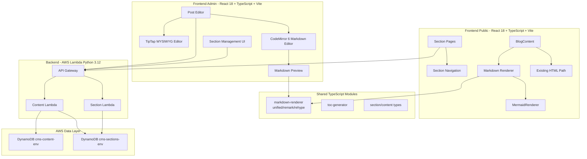
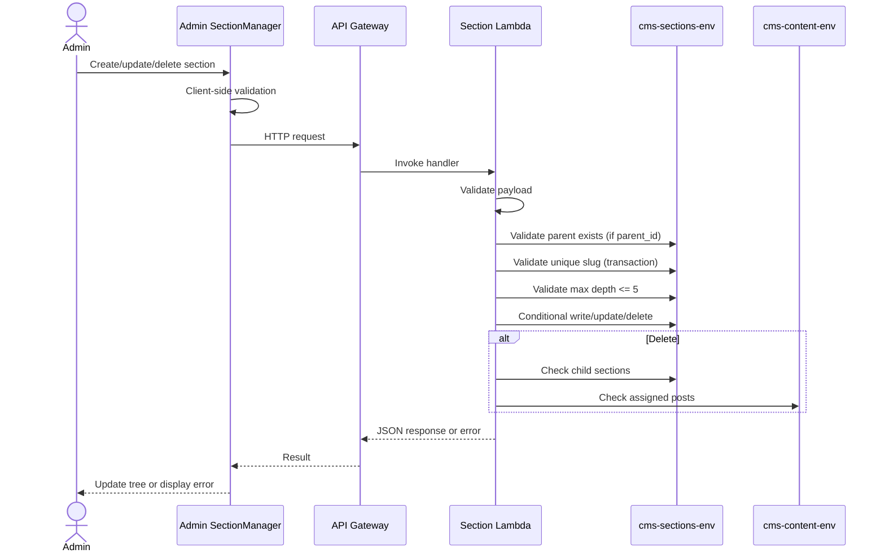

# Technical Design: Blog Sections & Markdown

## Overview

The `blog-sections-markdown` feature adds two major capabilities to the serverless CMS:

1. **Hierarchical blog sections** — A new DynamoDB-backed section taxonomy for organizing blog posts into a navigable tree structure (max 5 levels deep) with dedicated public URLs like `/blog/sections/engineering/platform/serverless`.

2. **Markdown authoring and rendering** — A full extended markdown pipeline using the unified/remark/rehype ecosystem, supporting GFM tables, footnotes, task lists, math/LaTeX (KaTeX), syntax-highlighted code blocks (Prism.js), Mermaid diagrams, and auto-generated table of contents.

The design preserves backward compatibility: existing HTML-only content continues through the current rendering path. The `content_markdown` field is authoritative only when present and non-empty.

## Architecture

### High-Level System Architecture



### Markdown Rendering Pipeline

```mermaid
flowchart LR
    Input["Markdown Source"] --> EmptyCheck["Empty/Whitespace Check"]
    EmptyCheck -->|empty| EmptyOutput["Return empty string"]
    EmptyCheck -->|non-empty| LengthCheck["500k Char Limit"]
    LengthCheck --> RemarkParse["remark-parse"]
    RemarkParse --> RemarkGfm["remark-gfm<br/>tables, tasks, strikethrough"]
    RemarkGfm --> RemarkMath["remark-math"]
    RemarkMath --> RemarkExtended["remark plugins<br/>definition-list, abbr, sup/sub"]
    RemarkExtended --> RemarkRehype["remark-rehype"]
    RemarkRehype --> HeadingIds["rehype heading IDs"]
    HeadingIds --> TocExtract["TOC extraction"]
    TocExtract --> RehypeKatex["rehype-katex"]
    RehypeKatex --> RehypePrism["rehype-prism-plus<br/>skip mermaid"]
    RehypePrism --> Sanitize["rehype-sanitize"]
    Sanitize --> RehypeStringify["rehype-stringify"]
    RehypeStringify --> HtmlOutput["Sanitized HTML"]
    TocExtract --> TocOutput["TOC model"]
```



### Section Management Data Flow



### Design Decisions & Rationale

| Decision | Rationale |
|----------|-----------|
| unified/remark/rehype for markdown | Modular plugin ecosystem, TypeScript support, AST-based (enables TOC extraction), rehype-react for direct React output, widely maintained |
| CodeMirror 6 for markdown editor | Lightweight, doesn't conflict with TipTap, excellent markdown mode, monospace by default |
| Single Sections DynamoDB table with slug-lock items | Enforces global slug uniqueness via DynamoDB transactions without needing a separate uniqueness table |
| Denormalized `section_id` and `section_path_ids` on content | Enables efficient GSI queries for posts-by-section without joins; ancestor inclusion via path_ids |
| Pre-rendered HTML stored in `content` field | Avoids rendering markdown on every public page load; public site can serve cached HTML |
| KaTeX over MathJax | Faster rendering, smaller bundle, CSS-based layout, better SSR compatibility |
| Shared markdown renderer module | Both admin preview and public site use identical rendering logic, ensuring WYSIWYG-like preview fidelity |

## Components and Interfaces

### Backend API Endpoints

#### Admin Section Endpoints (authenticated)

| Method | Path | Description |
|--------|------|-------------|
| `POST` | `/api/v1/sections` | Create section |
| `GET` | `/api/v1/sections` | Get all sections (tree or flat) |
| `GET` | `/api/v1/sections/{id}` | Get section by ID |
| `PUT` | `/api/v1/sections/{id}` | Update section |
| `DELETE` | `/api/v1/sections/{id}` | Delete section |

#### Public Section Endpoints (unauthenticated)

| Method | Path | Description |
|--------|------|-------------|
| `GET` | `/api/v1/public/sections/tree` | Get navigable section tree |
| `GET` | `/api/v1/public/sections/path/{path+}` | Resolve section by URL path |
| `GET` | `/api/v1/public/sections/{id}/posts` | Get posts for section + descendants |

### Python Lambda Function Signatures

#### Section Repository (`lambda/shared/sections_db.py`)

```python
class SectionRepository:
    """Repository for section management operations."""

    def create(self, item: dict) -> dict:
        """Create section with transactional slug uniqueness enforcement."""

    def get_by_id(self, section_id: str) -> dict | None:
        """Get section by UUID."""

    def get_by_slug(self, slug: str) -> dict | None:
        """Get section by slug using slug-index GSI."""

    def get_children(self, parent_id: str) -> list[dict]:
        """Get direct children of a section using parent_id-sort_order-index."""

    def get_all_sections(self) -> list[dict]:
        """Get all section records (excludes slug-lock items)."""

    def update(self, section_id: str, updates: dict) -> dict:
        """Update section fields with slug-lock transaction if slug changes."""

    def delete(self, section_id: str, slug: str) -> None:
        """Delete section and its slug-lock item transactionally."""

    def get_descendant_ids(self, section_id: str) -> list[str]:
        """Get all descendant section IDs by traversing path_ids."""

    def count_children(self, section_id: str) -> int:
        """Count direct child sections."""
```

#### Section Service (`lambda/sections/service.py`)

```python
def validate_section_input(data: dict, is_update: bool = False) -> list[str]:
    """Validate name length, slug format/length, sort_order range."""

def compute_depth(parent_id: str | None, sections_repo) -> int:
    """Compute depth from parent chain. Root = 1."""

def build_path(section_id: str, parent_id: str | None, slug: str, sections_repo) -> tuple[str, list[str]]:
    """Build full slug path and path_ids from root to this section."""

def build_tree(sections: list[dict]) -> list[dict]:
    """Convert flat section list to nested tree structure."""

def resolve_path(path: str, sections_repo) -> dict | None:
    """Resolve /slug1/slug2/slug3 to a section by walking the tree."""
```

#### Content Service Changes (`lambda/content/create.py`, `lambda/content/update.py`)

```python
def validate_section_assignment(section_id: str | None, sections_repo) -> None:
    """Validate section_id exists if provided. Raises ValidationError if not."""

def compute_section_path_ids(section_id: str, sections_repo) -> list[str]:
    """Get the full path_ids from the assigned section for ancestor queries."""
```

### TypeScript Shared Markdown Interfaces

```typescript
// frontend/shared/markdown/types.ts

export interface TocItem {
  id: string;
  text: string;
  level: 1 | 2 | 3 | 4 | 5 | 6;
  children: TocItem[];
}

export interface MarkdownRenderOptions {
  generateToc?: boolean;
  sanitize?: boolean;
  maxLength?: number;
}

export interface MarkdownRenderResult {
  html: string;
  toc: TocItem[];
  shouldShowToc: boolean;
  warnings: MarkdownRenderWarning[];
}

export interface MarkdownRenderWarning {
  code: 'EMPTY_INPUT' | 'MAX_LENGTH_EXCEEDED' | 'INVALID_LATEX'
      | 'UNSUPPORTED_LANGUAGE' | 'MALFORMED_SYNTAX';
  message: string;
  position?: { line: number; column: number };
}

export type SupportedLanguage =
  | 'python' | 'typescript' | 'javascript' | 'rust' | 'go'
  | 'java' | 'c' | 'css' | 'html' | 'sql' | 'bash'
  | 'json' | 'yaml' | 'toml' | 'markdown' | 'diff'
  | 'docker' | 'terraform' | 'graphql' | 'nix';
```

```typescript
// frontend/shared/markdown/renderMarkdown.ts

export function renderMarkdownToHtml(
  markdown: string,
  options?: MarkdownRenderOptions
): MarkdownRenderResult;

export function slugifyHeading(
  text: string,
  existingIds?: Map<string, number>
): string;

export function isMarkdownEmpty(markdown: string): boolean;
```

### TypeScript Section Types

```typescript
// frontend/shared/sections/types.ts

export interface Section {
  id: string;
  name: string;
  slug: string;
  parent_id: string | null;
  sort_order: number;
  description: string | null;
  depth: number;
  path: string;
  path_ids: string[];
  created_at: number;
  updated_at: number;
}

export interface SectionTreeNode extends Section {
  children: SectionTreeNode[];
  post_count?: number;
}

export interface CreateSectionRequest {
  name: string;
  slug: string;
  parent_id?: string | null;
  sort_order?: number;
  description?: string | null;
}

export interface UpdateSectionRequest {
  name?: string;
  slug?: string;
  parent_id?: string | null;
  sort_order?: number;
  description?: string | null;
}
```

### React Component Interfaces

#### Admin Panel

```typescript
// PostEditor mode toggle
export type EditorMode = 'wysiwyg' | 'markdown';

export interface PostEditorProps {
  value: PostEditorValue;
  onChange(value: PostEditorValue): void;
  availableSections: SectionTreeNode[];
  initialMode?: EditorMode;
}

// Markdown Editor (CodeMirror 6)
export interface MarkdownEditorProps {
  value: string;
  onChange(value: string): void;
  maxLength?: number;
  showPreview?: boolean;
}

// Section Manager
export interface SectionManagerProps {
  initialSections?: SectionTreeNode[];
}

// Section Form
export interface SectionFormProps {
  value?: Partial<CreateSectionRequest>;
  sections: SectionTreeNode[];
  mode: 'create' | 'edit';
  onSubmit(values: CreateSectionRequest): Promise<void>;
  onCancel(): void;
}
```

#### Public Website

```typescript
// BlogContent — updated to handle markdown path selection
export interface BlogContentProps {
  content: string;
  content_markdown?: string | null;
}

// MarkdownContent — renders markdown via shared pipeline
export interface MarkdownContentProps {
  markdown: string;
  showToc?: boolean;
}

// SectionNavigation — navigable tree sidebar
export interface SectionNavigationProps {
  tree: SectionTreeNode[];
  activeSectionId?: string;
}

// BlogSectionPage — section URL page
export interface BlogSectionPageProps {
  sectionPath: string;
}
```

### Markdown Pipeline Module Structure

```
frontend/shared/markdown/
├── index.ts
├── types.ts
├── renderMarkdown.ts
├── createProcessor.ts
├── sanitizeSchema.ts
├── toc.ts
├── slugify.ts
└── plugins/
    ├── rehypeHeadingIds.ts
    ├── rehypeExtractToc.ts
    ├── rehypeMermaidPassthrough.ts
    ├── remarkAbbreviations.ts
    ├── remarkDefinitionList.ts
    └── remarkSuperSub.ts
```

Key packages to install in public-website (and admin-panel):
- `unified`, `remark-parse`, `remark-gfm`, `remark-math`
- `remark-rehype`, `rehype-katex`, `rehype-prism-plus`, `rehype-stringify`, `rehype-sanitize`
- `katex` (CSS + rendering)
- `@codemirror/lang-markdown`, `@codemirror/view`, `@codemirror/state` (admin only)

## Data Models

### Sections Table (`cms-sections-{env}`)

**Primary Key:** `id` (String) — UUID

**GSIs:**
- `slug-index`: PK `slug` (String), Projection ALL
- `parent_id-sort_order-index`: PK `parent_id` (String), SK `sort_order` (Number), Projection ALL

**Section Record:**

```json
{
  "id": "2cb86c99-ef9b-4e22-80d6-13fd7c5f5d30",
  "entity_type": "section",
  "name": "Serverless",
  "slug": "serverless",
  "parent_id": "35b90f9c-9b4a-43f2-a816-73b74b2d3fdf",
  "sort_order": 20,
  "description": "Articles about serverless systems.",
  "depth": 3,
  "path": "engineering/platform/serverless",
  "path_ids": [
    "9c1a2d9f-f2cb-4888-a67b-3154edbdfc45",
    "35b90f9c-9b4a-43f2-a816-73b74b2d3fdf",
    "2cb86c99-ef9b-4e22-80d6-13fd7c5f5d30"
  ],
  "created_at": 1735689600,
  "updated_at": 1735689600
}
```

**Slug Lock Record (for uniqueness enforcement):**

```json
{
  "id": "SLUG#serverless",
  "entity_type": "slug_lock",
  "slug": "serverless",
  "section_id": "2cb86c99-ef9b-4e22-80d6-13fd7c5f5d30",
  "created_at": 1735689600
}
```

**Transactional Write (create section):**
1. Put section item — `ConditionExpression: attribute_not_exists(id)`
2. Put slug lock item `SLUG#{slug}` — `ConditionExpression: attribute_not_exists(id)`

### Content Table Additions

New attributes on existing `cms-content-{env}` records:

| Field | Type | Description |
|-------|------|-------------|
| `content_markdown` | String (max 500k) | Raw markdown source |
| `content_format` | `"markdown"` \| `"html"` | Active editing mode |
| `section_id` | String \| null | Denormalized from metadata.section_id |
| `section_path_ids` | List\<String\> | Full ancestor chain IDs for ancestor queries |

**New GSI on Content Table:**
- `section_id-published_at-index`: PK `section_id` (String), SK `published_at` (Number)

### CDK Infrastructure Changes

```typescript
// Added to DatabaseConstruct
this.sectionsTable = new dynamodb.Table(this, 'SectionsTable', {
  tableName: `cms-sections-${props.environment}`,
  partitionKey: { name: 'id', type: dynamodb.AttributeType.STRING },
  billingMode: dynamodb.BillingMode.PAY_PER_REQUEST,
  removalPolicy: cdk.RemovalPolicy.RETAIN,
  pointInTimeRecovery: true,
  encryption: dynamodb.TableEncryption.AWS_MANAGED,
});

this.sectionsTable.addGlobalSecondaryIndex({
  indexName: 'slug-index',
  partitionKey: { name: 'slug', type: dynamodb.AttributeType.STRING },
});

this.sectionsTable.addGlobalSecondaryIndex({
  indexName: 'parent_id-sort_order-index',
  partitionKey: { name: 'parent_id', type: dynamodb.AttributeType.STRING },
  sortKey: { name: 'sort_order', type: dynamodb.AttributeType.NUMBER },
});

// New GSI on existing Content Table
this.contentTable.addGlobalSecondaryIndex({
  indexName: 'section_id-published_at-index',
  partitionKey: { name: 'section_id', type: dynamodb.AttributeType.STRING },
  sortKey: { name: 'published_at', type: dynamodb.AttributeType.NUMBER },
});
```

### Section Tree Construction Algorithm

```python
def build_tree(sections: list[dict]) -> list[dict]:
    """Convert flat section list to nested tree.
    
    1. Filter to entity_type == "section"
    2. Sort by sort_order ASC, name ASC, id ASC (deterministic)
    3. Build id-to-node map, adding empty children list
    4. Attach each node to its parent's children list
    5. Return root nodes (parent_id is None)
    """
```

### Section URL Path Resolution

```python
def resolve_path(path: str, sections_repo) -> dict | None:
    """Resolve 'slug1/slug2/slug3' to a section.
    
    1. Split path by '/'
    2. For each segment, find section with matching slug AND parent_id
       matching the previous segment's section id (or None for first)
    3. Return final section or None if any segment fails
    """
```

### Ancestor Post Inclusion Query

```python
def get_section_posts(section_id: str, include_descendants: bool = True) -> list[dict]:
    """Get published posts for a section and optionally its descendants.
    
    1. Get descendant section IDs via path_ids traversal
    2. Query section_id-published_at-index for each relevant section_id
    3. Merge results, sort by published_at DESC
    4. Apply pagination
    """
```

## Correctness Properties

*A property is a characteristic or behavior that should hold true across all valid executions of a system—essentially, a formal statement about what the system should do. Properties serve as the bridge between human-readable specifications and machine-verifiable correctness guarantees.*

### Property 1: Section hierarchy parent validation

*For any* section creation with a parent_id, the operation succeeds only if the referenced parent exists in the Sections_Table; otherwise it returns a validation error.

**Validates: Requirements 1.2, 1.3**

### Property 2: Section slug uniqueness

*For any* two sections in the system, no two sections may share the same slug; attempting to create or update a section with a duplicate slug returns a validation error.

**Validates: Requirements 1.5, 1.6, 2.7**

### Property 3: Section nesting depth constraint

*For any* chain of parent-child sections, the system accepts sections at depths 1 through 5 and rejects any creation that would produce a chain deeper than 5 levels.

**Validates: Requirements 1.7, 1.8**

### Property 4: Section field validation

*For any* section input, the system rejects names exceeding 100 characters, slugs exceeding 120 characters, and slugs containing characters other than lowercase alphanumeric and hyphens.

**Validates: Requirements 2.9**

### Property 5: Section deletion constraint

*For any* section that has child sections or assigned posts, deletion is rejected with an appropriate error, and no data is modified.

**Validates: Requirements 2.4, 2.5, 3.7**

### Property 6: Section hierarchy tree construction

*For any* set of sections with parent-child relationships, the GET all sections endpoint returns a properly nested tree structure where each section's children array contains exactly its direct children, and root sections have no parent.

**Validates: Requirements 2.6**

### Property 7: Section CRUD round-trip

*For any* valid section data, creating a section and then retrieving it by ID returns a record with all original fields preserved plus auto-generated id and timestamps.

**Validates: Requirements 2.1, 2.2**

### Property 8: Content-section assignment validation

*For any* content creation or update with a section_id, the operation succeeds only if the section_id references an existing section; otherwise it returns a validation error.

**Validates: Requirements 3.1, 3.2**

### Property 9: Ancestor section post inclusion

*For any* post assigned to a section at depth N, querying any ancestor section (depth < N) includes that post in the results alongside directly-assigned posts.

**Validates: Requirements 3.5**

### Property 10: Section URL path construction

*For any* section in the hierarchy, the generated URL path equals the concatenation of slugs from root to that section, separated by forward slashes.

**Validates: Requirements 4.3**

### Property 11: Markdown storage round-trip

*For any* markdown input (up to 500,000 characters), saving content in markdown mode stores the raw source in content_markdown and simultaneously stores the rendered HTML in content, such that re-opening the content returns the original markdown source unchanged.

**Validates: Requirements 5.2**

### Property 12: GFM table rendering

*For any* valid GFM table input with varying column counts and alignment specifiers (`:---`, `:---:`, `---:`), the Markdown_Renderer produces HTML with `thead`/`tbody`/`th`/`td` elements and alignment attributes matching the source delimiters.

**Validates: Requirements 6.1**

### Property 13: Footnote rendering integrity

*For any* markdown with N footnote references and N matching definitions, the output contains N superscript anchor links and a footer ordered list with N items, each containing a back-reference link.

**Validates: Requirements 6.2**

### Property 14: Task list checkbox state

*For any* markdown task list with checked (`[x]`) and unchecked (`[ ]`) items, the rendered HTML contains disabled checkbox inputs whose checked state matches the source syntax.

**Validates: Requirements 6.3**

### Property 15: Extended syntax rendering

*For any* text using strikethrough (`~~`), definition list, abbreviation, superscript (`^`), or subscript (`~`) syntax, the Markdown_Renderer produces the corresponding HTML elements (`del`, `dl`/`dt`/`dd`, `abbr`, `sup`, `sub`).

**Validates: Requirements 6.4, 6.5, 6.6, 6.7**

### Property 16: Math delimiter handling

*For any* markdown with inline (`$...$`) or display (`$$...$$`) math, the renderer produces elements with class `math-inline` or `math-block` preserving the LaTeX expression unmodified; escaped dollar signs (`\$`) are treated as literal characters.

**Validates: Requirements 6.8, 8.5**

### Property 17: Malformed syntax graceful degradation

*For any* malformed or incomplete extended markdown syntax (unclosed table, unmatched `~~`, footnote reference without definition), the Markdown_Renderer outputs the source text as literal characters without applying the transformation.

**Validates: Requirements 6.9, 10.7**

### Property 18: Syntax highlighting with language

*For any* fenced code block specifying a supported language, the rendered output contains `span` elements with Prism.js-compatible CSS classes within a `pre>code` block; for unsupported or missing languages, it renders as plain `pre>code` with no syntax classes.

**Validates: Requirements 7.1, 7.3**

### Property 19: HTML entity escaping in code blocks

*For any* code block containing HTML special characters (`<`, `>`, `&`, `"`), the output contains the entity-escaped equivalents, preventing interpretation as markup.

**Validates: Requirements 7.5**

### Property 20: KaTeX rendering correctness

*For any* valid inline math expression, KaTeX renders it into an inline element; for valid display math, into a block-level element; for invalid LaTeX, the raw source is displayed with a KaTeX error message.

**Validates: Requirements 8.1, 8.2, 8.3**

### Property 21: TOC heading extraction

*For any* markdown with headings (h1-h6), the TOC_Generator extracts all headings in document order and produces a nested list reflecting the heading hierarchy.

**Validates: Requirements 9.1, 9.2**

### Property 22: TOC anchor ID generation

*For any* heading text, the generated anchor ID is: lowercase, spaces/special characters replaced with hyphens, non-alphanumeric (except hyphens) removed, consecutive hyphens collapsed; duplicate IDs receive numeric suffixes (`-1`, `-2`, etc.).

**Validates: Requirements 9.3, 9.4**

### Property 23: TOC display threshold

*For any* document, the table of contents is displayed if and only if the document contains 3 or more headings.

**Validates: Requirements 9.5, 9.6**

### Property 24: Deterministic rendering

*For any* markdown input, the Markdown_Renderer produces byte-identical HTML output on every invocation.

**Validates: Requirements 10.2**

### Property 25: XSS sanitization

*For any* markdown input, the rendered HTML output contains no script tags, no event handler attributes (`on*`), no `javascript:` URLs, no `data:` URIs in href attributes, and no iframe elements.

**Validates: Requirements 10.3**

### Property 26: Whitespace/empty input handling

*For any* input that is empty or composed entirely of whitespace characters, the Markdown_Renderer returns an empty string.

**Validates: Requirements 10.4, 10.5**

### Property 27: Rendering path selection

*For any* content item, if `content_markdown` is non-empty the public website renders via Markdown_Renderer; if `content_markdown` is empty or absent, it renders the `content` HTML field using the existing HTML path.

**Validates: Requirements 12.1, 12.2, 12.5**

## Error Handling

### API Error Response Format

```json
{
  "error": "VALIDATION_ERROR",
  "message": "Section slug already exists.",
  "details": { "field": "slug", "reason": "duplicate" }
}
```

### Section API Error Cases

| Scenario | HTTP Status | Error Code |
|----------|:-----------:|------------|
| Missing required `name` | 400 | VALIDATION_ERROR |
| `name` over 100 chars | 400 | VALIDATION_ERROR |
| Invalid slug format | 400 | VALIDATION_ERROR |
| Slug over 120 chars | 400 | VALIDATION_ERROR |
| Duplicate slug | 409 | CONFLICT |
| Parent does not exist | 400 | VALIDATION_ERROR |
| Nesting exceeds 5 levels | 400 | VALIDATION_ERROR |
| Section not found | 404 | NOT_FOUND |
| Delete section with children | 409 | CONFLICT |
| Delete section with posts | 409 | CONFLICT |
| DynamoDB transaction conflict | 409 | CONFLICT |
| Unexpected error | 500 | INTERNAL_ERROR |

### Content API Error Cases

| Scenario | HTTP Status | Error Code |
|----------|:-----------:|------------|
| `content_markdown` over 500k chars | 400 | VALIDATION_ERROR |
| `metadata.section_id` doesn't exist | 400 | VALIDATION_ERROR |
| Invalid `content_format` value | 400 | VALIDATION_ERROR |

### Markdown Rendering Error Handling

The renderer never throws for normal malformed user input. It gracefully degrades:

| Scenario | Behavior |
|----------|----------|
| Empty/whitespace-only input | Return empty string, empty TOC |
| Invalid LaTeX | Render raw source with KaTeX error styling |
| Unsupported code language | Render plain `pre>code` without highlighting |
| Mermaid code block | Pass through to MermaidRenderer component |
| Malformed table/syntax | Render as literal text per CommonMark spec |
| XSS attempt in markdown | Sanitizer removes unsafe elements |

### Logging

Backend logs include request ID, actor ID, route, validation failure codes, and DynamoDB transaction cancellation reasons. Full markdown/HTML bodies are NOT logged.

## Testing Strategy

### Dual Testing Approach

- **Unit tests**: Verify specific examples, edge cases, error conditions, and integration points
- **Property-based tests**: Verify universal properties across randomized inputs using `fast-check` (already in public-website) with minimum 100 iterations per property

### Backend Tests (pytest + moto)

```
tests/
├── test_sections_crud.py          # Create, read, update, delete operations
├── test_sections_validation.py    # Field validation, slug format, depth limits
├── test_sections_tree.py          # Tree construction, path resolution
├── test_sections_posts.py         # Post queries by section, ancestor inclusion
├── test_content_markdown.py       # content_markdown storage, section_id validation
└── test_sections_integration.py   # Full API integration tests
```

Key backend test scenarios:
- Parent validation (valid/invalid parent_id)
- Slug uniqueness via transactions
- Max depth 5 enforcement
- Delete constraints (children, posts)
- Tree construction from flat records
- Path resolution with multi-segment URLs
- Section-content assignment and ancestor post inclusion

### Frontend Markdown Renderer Tests (Vitest + fast-check)

```
frontend/shared/markdown/__tests__/
├── renderMarkdown.gfm.test.ts
├── renderMarkdown.footnotes.test.ts
├── renderMarkdown.tasks.test.ts
├── renderMarkdown.extendedSyntax.test.ts
├── renderMarkdown.math.test.ts
├── renderMarkdown.codeBlocks.test.ts
├── renderMarkdown.mermaid.test.ts
├── renderMarkdown.toc.test.ts
├── renderMarkdown.sanitize.test.ts
├── renderMarkdown.determinism.test.ts
└── renderMarkdown.properties.test.ts   # Property-based tests
```

### Property-Based Test Configuration

Using `fast-check` with minimum 100 iterations per property. Each test is tagged:

```typescript
// Feature: blog-sections-markdown, Property 24: Deterministic rendering
it('produces byte-identical output on repeated invocations', () => {
  fc.assert(
    fc.property(fc.string({ maxLength: 10_000 }), (markdown) => {
      const a = renderMarkdownToHtml(markdown).html;
      const b = renderMarkdownToHtml(markdown).html;
      expect(a).toBe(b);
    }),
    { numRuns: 100 }
  );
});

// Feature: blog-sections-markdown, Property 26: Whitespace/empty input handling
it('returns empty string for whitespace-only input', () => {
  fc.assert(
    fc.property(
      fc.stringOf(fc.constantFrom(' ', '\t', '\n', '\r')),
      (whitespace) => {
        const result = renderMarkdownToHtml(whitespace);
        expect(result.html).toBe('');
      }
    ),
    { numRuns: 100 }
  );
});

// Feature: blog-sections-markdown, Property 22: TOC anchor ID generation
it('generates valid slugified anchor IDs', () => {
  fc.assert(
    fc.property(fc.string({ minLength: 1 }), (heading) => {
      const id = slugifyHeading(heading);
      expect(id).toBe(id.toLowerCase());
      expect(id).toMatch(/^[a-z0-9-]*$/);
      expect(id).not.toContain('--');
    }),
    { numRuns: 100 }
  );
});
```

### Frontend Component Tests (Vitest + React Testing Library)

**Admin Panel:**
- Mode toggle between WYSIWYG and Markdown
- Section tree rendering and interaction
- Section form validation (slug format, name length)
- Delete confirmation dialog with child/post counts
- Section selector dropdown in post editor

**Public Website:**
- Rendering path selection (content_markdown vs content)
- TOC display threshold (3+ headings)
- Section navigation tree rendering
- Section page post listing with pagination
- Backward compatibility with existing HTML content

### Security Tests

Verify XSS sanitization for:
- `<script>` tags in markdown
- `javascript:` URLs in links
- Event handler attributes (`onclick`, `onerror`)
- `data:` URIs in href
- `<iframe>` elements
- Code blocks containing HTML (should be escaped, not executed)

### Performance Targets

| Operation | Target |
|-----------|--------|
| Render 100k char markdown | < 500ms |
| Build section tree (1000 sections) | < 100ms |
| Public page render path decision | O(1) |
| Section post query | Paginated, bounded by page size |
