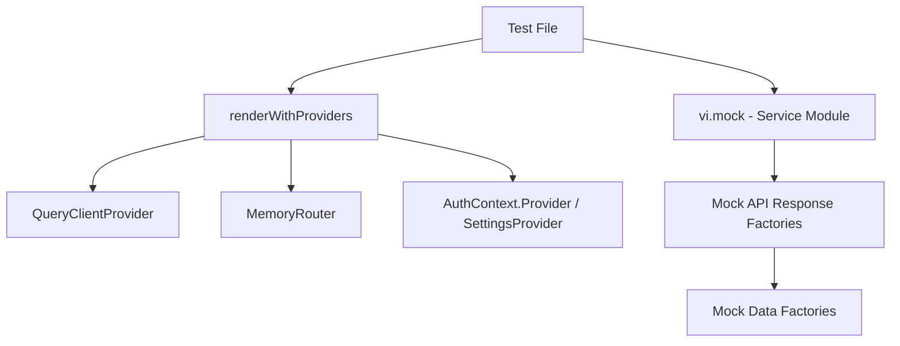

# Design Document: Frontend Component Tests

## Overview

This design specifies the test infrastructure and component test implementation for both frontend applications (admin panel and public website). The goal is to replace stub tests with meaningful component tests that validate rendering, user interactions, API integration (mocked), routing, and context usage.

The design leverages the existing Vitest + React Testing Library setup already configured in both projects. It introduces reusable mock utilities, test wrappers, and data factories that minimize boilerplate and ensure consistency across all test files.

**Key Design Decisions:**
- Co-locate test files with source files using `__tests__/` directories (matching existing pattern in public-website)
- Shared mock utilities live in `src/test/` alongside the existing setup file
- Mock API calls at the module level using `vi.mock()` for services, not at the axios instance level
- Use `@tanstack/react-query` test utilities (`QueryClientProvider`) for hook testing in the admin panel
- Each test file is self-contained: imports wrappers, sets up mocks, tests one component/hook/service

## Architecture

### Test File Organization

```
frontend/admin-panel/src/
├── test/
│   ├── setup.ts                    (existing)
│   ├── mocks/
│   │   ├── handlers.ts             (mock API response factories)
│   │   └── data.ts                 (mock data factories)
│   └── utils/
│       ├── renderWithProviders.tsx  (wrapper with Auth, Router, QueryClient)
│       └── createMockAuthContext.ts (configurable auth state)
├── services/__tests__/
│   ├── api.test.ts
│   └── auth.test.ts
├── hooks/__tests__/
│   ├── useAuth.test.tsx
│   ├── useContent.test.ts
│   ├── useMedia.test.ts
│   ├── useUsers.test.ts
│   ├── useComments.test.ts
│   ├── useSettings.test.ts
│   └── usePlugins.test.ts
├── components/__tests__/
│   ├── ProtectedRoute.test.tsx
│   └── Layout.test.tsx
└── pages/__tests__/
    ├── Dashboard.test.tsx
    ├── ContentList.test.tsx
    ├── ContentEditor.test.tsx
    ├── MediaLibrary.test.tsx
    ├── Users.test.tsx
    ├── Comments.test.tsx
    ├── Settings.test.tsx
    ├── Plugins.test.tsx
    └── Login.test.tsx

frontend/public-website/src/
├── test/
│   ├── setup.ts                    (existing)
│   ├── mocks/
│   │   ├── handlers.ts             (mock API response factories)
│   │   └── data.ts                 (mock data factories)
│   └── utils/
│       ├── renderWithProviders.tsx  (wrapper with Settings, Router, QueryClient)
│       └── createMockSettingsContext.ts
├── services/__tests__/
│   └── api.test.ts                 (replace existing stub)
├── hooks/__tests__/
│   ├── useContent.test.ts
│   ├── useComments.test.ts
│   └── useSiteSettings.test.ts
├── contexts/__tests__/
│   └── SettingsContext.test.tsx
├── components/__tests__/
│   ├── PostCard.test.tsx
│   ├── CommentList.test.tsx
│   ├── CommentForm.test.tsx
│   ├── CodeBlock.test.tsx
│   └── Lightbox.test.tsx
└── pages/__tests__/
    ├── Home.test.tsx
    ├── Blog.test.tsx
    ├── Post.test.tsx
    ├── Gallery.test.tsx
    ├── Projects.test.tsx
    ├── Login.test.tsx
    ├── Register.test.tsx
    └── VerifyEmail.test.tsx
```

### Mocking Strategy



**Approach:** Mock at the service layer (`vi.mock('../services/api')`) rather than at the network level. This keeps tests fast, deterministic, and decoupled from HTTP implementation details. For hooks that use `@tanstack/react-query`, provide a fresh `QueryClient` per test with retry disabled.

### Testing Layers

| Layer | What's Tested | Mock Strategy |
|-------|--------------|---------------|
| Services | HTTP method, URL, headers, error propagation | Mock `axios` instance methods |
| Hooks | Data fetching, state transitions, mutations | Mock service module, wrap in QueryClientProvider |
| Contexts | State management, provider behavior | Mock underlying services |
| Components | Rendering, user interactions, conditional display | Mock hooks or service layer |
| Pages | Full page rendering, routing integration, form flows | Mock hooks, wrap in all providers |

## Components and Interfaces

### Admin Panel Test Utilities

#### `renderWithProviders` (Admin)

```typescript
// src/test/utils/renderWithProviders.tsx
interface RenderOptions {
  authState?: Partial<AuthContextType>;
  route?: string;
  routePath?: string;
  queryClient?: QueryClient;
}

function renderWithProviders(
  ui: ReactElement,
  options?: RenderOptions
): RenderResult & { queryClient: QueryClient }
```

Wraps the component in:
1. `QueryClientProvider` — fresh client with `retry: false`, `gcTime: 0`
2. `AuthContext.Provider` — configurable auth state (defaults to authenticated admin)
3. `MemoryRouter` — configurable initial route and route path pattern

#### `createMockAuthContext`

```typescript
// src/test/utils/createMockAuthContext.ts
interface MockAuthOptions {
  isAuthenticated?: boolean;
  isLoading?: boolean;
  user?: Partial<User> | null;
  role?: UserRole;
}

function createMockAuthContext(options?: MockAuthOptions): AuthContextType
```

Returns a complete `AuthContextType` object with `vi.fn()` for `login`, `logout`, `refreshUser`. Defaults to an authenticated admin user.

### Public Website Test Utilities

#### `renderWithProviders` (Public)

```typescript
// src/test/utils/renderWithProviders.tsx
interface RenderOptions {
  settings?: Partial<SiteSettings>;
  route?: string;
  routePath?: string;
  queryClient?: QueryClient;
}

function renderWithProviders(
  ui: ReactElement,
  options?: RenderOptions
): RenderResult & { queryClient: QueryClient }
```

Wraps the component in:
1. `QueryClientProvider` — fresh client with `retry: false`
2. `SettingsContext.Provider` — configurable site settings (defaults to all features enabled)
3. `MemoryRouter` — configurable initial route

#### `createMockSettingsContext`

```typescript
// src/test/utils/createMockSettingsContext.ts
interface MockSettingsOptions {
  settings?: Partial<SiteSettings>;
  loading?: boolean;
  error?: string | null;
}

function createMockSettingsContext(options?: MockSettingsOptions): SettingsContextType
```

### Mock Data Factories

#### Admin Panel — `src/test/mocks/data.ts`

```typescript
function createMockContent(overrides?: Partial<Content>): Content
function createMockMedia(overrides?: Partial<Media>): Media
function createMockUser(overrides?: Partial<User>): User
function createMockPlugin(overrides?: Partial<Plugin>): Plugin
function createMockSettings(overrides?: Partial<SiteSettings>): SiteSettings
function createMockComment(overrides?: Partial<Comment>): Comment
function createMockContentList(count?: number): ContentListResponse
function createMockMediaList(count?: number): MediaListResponse
```

Each factory returns a fully valid object with realistic defaults. Overrides let individual tests customize specific fields.

#### Public Website — `src/test/mocks/data.ts`

```typescript
function createMockContent(overrides?: Partial<Content>): Content
function createMockComment(overrides?: Partial<Comment>): Comment
function createMockSettings(overrides?: Partial<SiteSettings>): SiteSettings
function createMockContentList(count?: number): PaginatedResponse<Content>
```

### Mock API Handlers

#### Admin Panel — `src/test/mocks/handlers.ts`

```typescript
// Pre-configured mock implementations for vi.mocked(api)
const mockApiHandlers = {
  listContent: vi.fn().mockResolvedValue(createMockContentList()),
  getContent: vi.fn().mockResolvedValue(createMockContent()),
  createContent: vi.fn().mockResolvedValue(createMockContent()),
  // ... all API methods
}
```

#### Public Website — `src/test/mocks/handlers.ts`

```typescript
const mockApiHandlers = {
  listContent: vi.fn().mockResolvedValue(createMockContentList()),
  getContentBySlug: vi.fn().mockResolvedValue(createMockContent()),
  getComments: vi.fn().mockResolvedValue([createMockComment()]),
  createComment: vi.fn().mockResolvedValue(createMockComment()),
  getPublicSettings: vi.fn().mockResolvedValue(createMockSettings()),
  // ... all public API methods
}
```

## Data Models

### Mock Data Shapes

These mirror the TypeScript types from each project's `types/` directory.

**Content (Admin):**
```typescript
{
  id: 'content-001',
  type: 'post',
  title: 'Test Post',
  slug: 'test-post',
  content: '<p>Test content</p>',
  excerpt: 'Test excerpt',
  author: 'user-001',
  author_name: 'Test Author',
  status: 'published',
  featured_image: 'https://example.com/image.jpg',
  metadata: { tags: ['test'], categories: ['general'] },
  created_at: 1700000000,
  updated_at: 1700000000,
  published_at: 1700000000,
}
```

**User:**
```typescript
{
  id: 'user-001',
  email: 'admin@example.com',
  username: 'admin',
  name: 'Test Admin',
  display_name: 'Test Admin',
  role: 'admin',
  created_at: 1700000000,
  last_login: 1700000000,
}
```

**Comment:**
```typescript
{
  id: 'comment-001',
  content_id: 'content-001',
  author_name: 'Commenter',
  comment_text: 'Great post!',
  status: 'approved',
  created_at: 1700000000,
  updated_at: 1700000000,
}
```

**SiteSettings (Public):**
```typescript
{
  site_title: 'Test Site',
  site_description: 'A test site',
  theme: 'default',
  registration_enabled: true,
  comments_enabled: true,
  captcha_enabled: false,
}
```

## Error Handling

### Test Error Patterns

1. **API Error Simulation**: Mock services reject with `ApiError` instances for error-path testing. Each service test verifies error propagation.

2. **Async Error Boundaries**: Tests that verify error states use `waitFor` to allow React state updates to complete. Hook tests using `@tanstack/react-query` check `result.current.error` after the query settles.

3. **Timeout Prevention**: All async assertions use explicit timeouts via `waitFor({ timeout: 5000 })`. The QueryClient is configured with `retry: false` to prevent retry delays in tests.

4. **Console Error Suppression**: Tests that intentionally trigger errors (e.g., 401 responses, failed fetches) suppress expected console.error output using `vi.spyOn(console, 'error').mockImplementation(() => {})` and restore in `afterEach`.

5. **Navigation Error Handling**: Page tests that trigger navigation (login form submit, protected route redirect) use `MemoryRouter` with assertions on rendered route content rather than `window.location` checks.

### Test Isolation

- Each test file creates its own `QueryClient` instance (via `renderWithProviders`)
- `cleanup()` runs after each test (already in setup.ts)
- `vi.clearAllMocks()` in `beforeEach` to reset mock call counts
- No shared mutable state between tests

## Testing Strategy

### Framework and Configuration

Both projects already have Vitest configured with:
- `jsdom` environment
- `@testing-library/react` for rendering
- `@testing-library/jest-dom` for DOM matchers
- `@testing-library/user-event` for interaction simulation
- `v8` coverage provider
- Global test APIs enabled (`globals: true`)

### Test Execution

```bash
# Admin panel tests
cd frontend/admin-panel && npm test -- --run

# Public website tests
cd frontend/public-website && npm test -- --run

# With coverage
cd frontend/admin-panel && npm test -- --run --coverage
cd frontend/public-website && npm test -- --run --coverage
```

### Why Property-Based Testing Does Not Apply

This feature implements React component tests — verifying that specific UI elements render correctly, user interactions trigger expected behavior, and mocked API responses display properly. The system under test produces DOM output from fixed mock inputs. There are no:
- Pure functions with meaningful input variation
- Serialization/deserialization round-trips
- Algorithms or data transformations with universal properties
- Input spaces where randomization would reveal edge cases

All acceptance criteria are best served by example-based unit tests that assert specific rendering outcomes for specific mock inputs.

### Test Patterns

**Component rendering tests:**
```typescript
it('renders post title and excerpt', () => {
  renderWithProviders(<PostCard post={createMockContent()} />);
  expect(screen.getByText('Test Post')).toBeInTheDocument();
  expect(screen.getByText('Test excerpt')).toBeInTheDocument();
});
```

**User interaction tests:**
```typescript
it('submits login form', async () => {
  const user = userEvent.setup();
  renderWithProviders(<Login />);
  await user.type(screen.getByLabelText(/email/i), 'test@example.com');
  await user.type(screen.getByLabelText(/password/i), 'password');
  await user.click(screen.getByRole('button', { name: /sign in/i }));
  expect(mockLogin).toHaveBeenCalledWith('test@example.com', 'password');
});
```

**Hook tests:**
```typescript
it('fetches content list', async () => {
  const { result } = renderHook(() => useContentList(), { wrapper });
  await waitFor(() => expect(result.current.isSuccess).toBe(true));
  expect(result.current.data.items).toHaveLength(3);
});
```

**Protected route tests:**
```typescript
it('redirects unauthenticated users to login', () => {
  renderWithProviders(<ProtectedRoute><Dashboard /></ProtectedRoute>, {
    authState: { isAuthenticated: false, isLoading: false },
  });
  expect(screen.queryByText('Dashboard')).not.toBeInTheDocument();
});
```

### Coverage Goals

- Target: >80% line coverage for tested components, hooks, and services
- Coverage exclusions (already configured): `node_modules/`, `src/test/`, type files, configs
- CI integration: `npm test -- --run --coverage` in GitHub Actions pipeline

### Test Naming Conventions

- Describe blocks: component/hook/service name
- Test names: describe the behavior being verified in plain language
- Format: `it('displays error message when API returns 500')`
- Group related tests: `describe('when authenticated')`, `describe('error states')`
