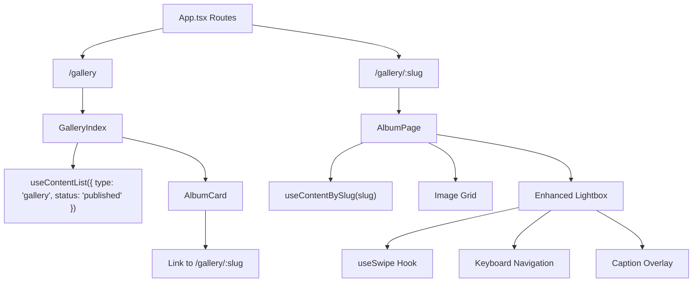
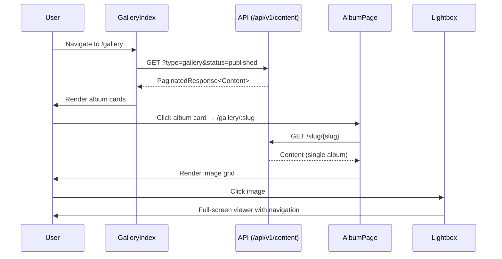

# Design Document: Gallery Album Experience

## Overview

The `gallery-album-experience` feature refactors the current flat gallery view into an album-based browsing experience.

**Current behavior:**
- `/gallery` renders all images from all gallery content records in a flat layout with sections
- `Lightbox.tsx` supports keyboard navigation (Escape, Arrow keys), next/prev buttons, captions below the image, and an image counter

**Target behavior:**
- `/gallery` renders a `GalleryIndex` page with album cards (cover image, title, excerpt, image count)
- `/gallery/:slug` renders an `AlbumPage` showing all images for a single gallery album in a responsive grid
- The existing `Lightbox` is enhanced with pointer-based swipe gestures and an improved caption overlay positioned on the image

The implementation uses existing project conventions: React 18, TypeScript, Vite, Tailwind CSS, react-router-dom v6, react-helmet-async, @tanstack/react-query v5, and the existing `useContentList` / `useContentBySlug` hooks.

---

## Architecture

The feature introduces album-oriented routing with two pages sharing the `/gallery` path prefix.

### Routes

```tsx
<Route path="/gallery" element={<GalleryIndex />} />
<Route path="/gallery/:slug" element={<AlbumPage />} />
```

### Component Architecture



### Data Flow



---

## Components and Interfaces

### GalleryIndex

**File:** `src/pages/Gallery.tsx` (refactored in place)

The existing `Gallery` component is refactored to render album cards instead of all images. The export name remains `Gallery` for route compatibility.

```ts
// Derives album card data from Content records
interface AlbumCardData {
  id: string;
  title: string;
  slug: string;
  excerpt: string;
  imageCount: number;
  coverUrl: string;
  coverAlt: string;
}
```

**Mapping rules:**

| Field | Source |
|-------|--------|
| `coverUrl` | `media[0].thumbnails.large` → `media[0].s3_url` → placeholder |
| `coverAlt` | `media[0].metadata.alt_text` → album title |
| `imageCount` | `media.length` |

**Layout:** Responsive grid — 1 column mobile, 2 columns tablet (`sm:`), 3 columns desktop (`lg:`).

---

### AlbumCard

**Inline component** within `Gallery.tsx` (or extracted if needed).

```ts
interface AlbumCardProps {
  title: string;
  slug: string;
  excerpt: string;
  imageCount: number;
  coverUrl: string;
  coverAlt: string;
}
```

- Renders as a `<Link>` from react-router-dom (semantic `<a>` element)
- Navigates to `/gallery/${slug}`
- Displays cover image with `aspect-[4/3]`, title, excerpt, and image count badge
- Hover state: slight scale on image, shadow elevation on card

---

### AlbumPage

**File:** `src/pages/AlbumPage.tsx` (new)

```ts
// Component state
const { slug } = useParams<{ slug: string }>();
const { data: album, isLoading, isError } = useContentBySlug(slug ?? '');
const [selectedIndex, setSelectedIndex] = useState<number | null>(null);
const media: Media[] = album?.metadata?.media ?? [];
```

**Responsibilities:**
- Fetch album by slug using `useContentBySlug`
- Validate content is a published gallery
- Render image grid using thumbnail variants (`thumbnails.medium`)
- Lazy-load images below the fold (`loading="lazy"`)
- Open Lightbox on image click with the selected index
- Set SEO metadata via `react-helmet-async`
- Include back-navigation link to `/gallery`

**Image grid:** `grid gap-4 sm:grid-cols-2 md:grid-cols-3 lg:grid-cols-4`

---

### Lightbox (Enhanced)

**File:** `src/components/Lightbox.tsx` (extended)

The existing Lightbox is enhanced with:
1. Touch/swipe gesture support via `useSwipe`
2. Caption overlay repositioned to bottom of image (semi-transparent dark bar)
3. `role="dialog"` and `aria-modal="true"` for accessibility

```ts
interface LightboxProps {
  images: Media[];
  currentIndex: number;
  onClose: () => void;
  onNext: () => void;
  onPrevious: () => void;
}
```

**Caption overlay:** Positioned absolutely at the bottom of the image container with `bg-black/70 text-white` styling. Only rendered when a caption exists.

**Navigation bounds:** Previous button hidden at index 0, next button hidden at last index.

**Position indicator:** Shows `{currentIndex + 1} / {total}` at top-right of overlay.

---

### useSwipe Hook

**File:** `src/hooks/useSwipe.ts` (new)

```ts
interface UseSwipeOptions {
  onSwipeLeft?: () => void;
  onSwipeRight?: () => void;
  threshold?: number; // default: 50px
}

interface SwipeHandlers {
  onPointerDown: React.PointerEventHandler;
  onPointerMove: React.PointerEventHandler;
  onPointerUp: React.PointerEventHandler;
  onPointerCancel: React.PointerEventHandler;
}

function useSwipe(options: UseSwipeOptions): SwipeHandlers;
```

**Design decisions:**
- Uses pointer events (works for both mouse and touch)
- Tracks single active pointer
- Triggers callback only when horizontal movement exceeds threshold AND is dominant over vertical movement
- Resets on `pointerup` and `pointercancel`

**Pure detection logic (extracted for testing):**

```ts
type SwipeDirection = 'left' | 'right' | 'none';

interface SwipeInput {
  startX: number;
  startY: number;
  endX: number;
  endY: number;
  threshold: number;
}

function detectSwipe(input: SwipeInput): SwipeDirection;
```

---

## Data Models

### Existing Types (no changes needed)

The feature uses `Content` and `Media` interfaces from `src/types/index.ts` without modification.

- **Gallery listing:** `useContentList({ type: 'gallery', status: 'published' })` returns `PaginatedResponse<Content>`
- **Single album:** `useContentBySlug(slug)` returns `Content`
- **Images:** `Content.metadata.media` is `Media[]`

### View Model: GalleryAlbumCardModel

```ts
interface GalleryAlbumCardModel {
  id: string;
  title: string;
  slug: string;
  excerpt: string;
  imageCount: number;
  coverUrl: string;
  coverAlt: string;
}
```

**Transformation function (pure, testable):**

```ts
function toAlbumCard(content: Content): GalleryAlbumCardModel;
```

Rules:
- `imageCount` = `content.metadata.media?.length ?? 0`
- `coverUrl` = first media's `thumbnails.large` → first media's `s3_url` → `PLACEHOLDER_IMAGE`
- `coverAlt` = first media's `metadata.alt_text` → `content.title`

### Image Source Selection

| Context | Source |
|---------|--------|
| Album card cover | `media[0].thumbnails.large` or `media[0].s3_url` |
| Album grid thumbnail | `image.thumbnails.medium` or `image.s3_url` |
| Lightbox full-size | `image.s3_url` |
| Alt text | `image.metadata.alt_text` or album title |
| Caption | `image.metadata.caption` (may be undefined) |

---

## Correctness Properties

*A property is a characteristic or behavior that should hold true across all valid executions of a system — essentially, a formal statement about what the system should do. Properties serve as the bridge between human-readable specifications and machine-verifiable correctness guarantees.*

### Property 1: Album card count matches published album count

*For any* list of published gallery content items, the GalleryIndex SHALL render exactly one AlbumCard per item in the list.

**Validates: Requirements 1.1**

### Property 2: Album card displays all required information

*For any* gallery Content item with a non-empty media array, the derived AlbumCardModel SHALL contain the album title, excerpt, an imageCount equal to the media array length, and a coverUrl sourced from the first media item.

**Validates: Requirements 1.2, 8.1**

### Property 3: Album card link matches slug

*For any* gallery Content item with a slug, the rendered AlbumCard link href SHALL equal `/gallery/{slug}`.

**Validates: Requirements 2.1**

### Property 4: Album page renders all images from media array

*For any* gallery Content item, the AlbumPage SHALL render one image element per entry in the media array, using the thumbnail variant as the source.

**Validates: Requirements 3.2, 3.3**

### Property 5: Clicking image opens viewer at correct index

*For any* valid index I within a media array of length N, clicking the image at index I SHALL open the Image Viewer displaying the image at that same index I.

**Validates: Requirements 4.1**

### Property 6: Navigation index stays within bounds

*For any* image array of length N > 0 and any current index I (0 ≤ I < N), navigating next SHALL produce an index in [0, N-1] and navigating previous SHALL produce an index in [0, N-1]. Navigation controls SHALL be hidden at boundaries (previous hidden at I=0, next hidden at I=N-1).

**Validates: Requirements 5.1, 5.2, 5.3, 5.4, 5.7, 5.8**

### Property 7: Swipe gesture direction maps to correct navigation

*For any* swipe input where horizontal movement exceeds the threshold and is dominant over vertical movement, a leftward swipe SHALL trigger next-image navigation and a rightward swipe SHALL trigger previous-image navigation. Movements below threshold or vertical-dominant movements SHALL trigger no navigation.

**Validates: Requirements 5.5, 5.6**

### Property 8: Caption displayed if and only if present

*For any* Media item displayed in the Image Viewer, the caption overlay SHALL be rendered if and only if `metadata.caption` is a non-empty string.

**Validates: Requirements 6.1, 6.3**

### Property 9: Position indicator accuracy

*For any* image array of length N and current index I, the position indicator SHALL display the text `{I+1} / {N}`.

**Validates: Requirements 6.4**

### Property 10: SEO metadata format correctness

*For any* album title and site title, the Gallery Index page title SHALL equal `"Gallery - {site_title}"`, the Album Page title SHALL equal `"{album_title} - Gallery - {site_title}"`, and the Album Page meta description SHALL equal the album excerpt.

**Validates: Requirements 7.1, 7.2, 7.3**

---

## Error Handling

### GalleryIndex

| State | Behavior |
|-------|----------|
| Loading | Display spinner/skeleton while `useContentList` is pending |
| Error | Show user-friendly error message with `role="alert"` |
| Empty | Show "No galleries are available yet." message |
| Missing cover | Use placeholder image (`/images/gallery-placeholder.jpg`) |

### AlbumPage

| State | Behavior |
|-------|----------|
| Missing slug | Display not-found message |
| Loading | Display spinner while `useContentBySlug` is pending |
| Error | Show user-friendly error message with `role="alert"` |
| Not found / wrong type | Display "Gallery album not found." |
| Empty album | Show "This album does not contain any images yet." |

### Lightbox

| State | Behavior |
|-------|----------|
| Empty images array | Render nothing (`null`) |
| Index out of bounds | Clamp to valid range: `Math.min(Math.max(index, 0), length - 1)` |
| Missing caption | Omit caption overlay entirely |
| Missing alt text | Fall back to empty string (caller should provide album title) |

---

## Testing Strategy

Testing uses a dual approach:
1. **Unit tests** with Vitest + React Testing Library for specific examples, edge cases, accessibility
2. **Property-based tests** with `fast-check` for universal properties across generated inputs

### Property-Based Testing Configuration

- Library: `fast-check`
- Minimum iterations: 100 per property
- Tag format: `Feature: gallery-album-experience, Property {number}: {property_text}`

### Extracted Pure Functions for PBT

The following functions should be extracted as pure, testable units:

```ts
// Navigation logic
function getNextIndex(current: number, total: number): number;
function getPreviousIndex(current: number, total: number): number;
function isAtStart(index: number): boolean;
function isAtEnd(index: number, total: number): boolean;

// Data transformation
function toAlbumCard(content: Content): GalleryAlbumCardModel;

// Swipe detection
function detectSwipe(input: SwipeInput): SwipeDirection;

// SEO formatting
function formatGalleryTitle(siteTitle: string): string;
function formatAlbumTitle(albumTitle: string, siteTitle: string): string;

// Position indicator
function formatPositionIndicator(index: number, total: number): string;
```

### Unit Test Coverage

#### GalleryIndex
- Loading state renders spinner
- Error state renders alert message
- Empty state renders "no galleries" message
- Renders correct number of album cards
- Album cards are `<a>` elements (semantic links)
- Responsive grid classes are applied (`grid`, `sm:grid-cols-2`, `lg:grid-cols-3`)

#### AlbumPage
- Loading state renders spinner
- Not-found state when slug doesn't match
- Empty album state when media is empty
- All images rendered in grid
- Images use `loading="lazy"` attribute
- Back link to `/gallery` is present
- SEO helmet sets correct title and description
- Clicking image opens lightbox at correct index

#### Lightbox
- Renders nothing when images array is empty
- Escape key closes viewer
- ArrowRight navigates next
- ArrowLeft navigates previous
- Close button calls onClose
- Previous button hidden at first image
- Next button hidden at last image
- Caption overlay renders with correct classes (`absolute bottom-0 bg-black/70`)
- `role="dialog"` and `aria-modal="true"` present
- Touch swipe left triggers next
- Touch swipe right triggers previous

#### useSwipe
- Calls onSwipeLeft for leftward pointer movement exceeding threshold
- Calls onSwipeRight for rightward pointer movement exceeding threshold
- No callback when movement below threshold
- No callback for vertical-dominant gestures
- State resets after pointerup and pointercancel
