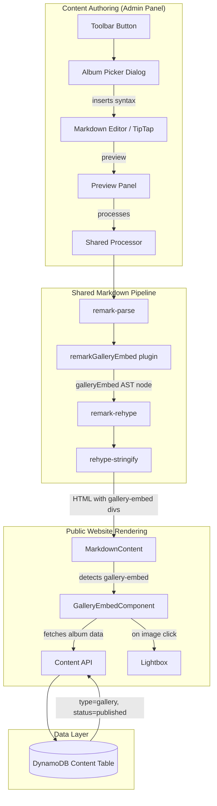

# Design Document: Gallery Markdown Embed

## Overview

This feature extends the serverless CMS markdown pipeline with a custom directive syntax (`::gallery[ALBUM_ID]{options}`) that embeds interactive gallery albums within blog posts and pages. It spans three layers:

1. **Shared markdown pipeline** — A new remark plugin parses the directive into AST nodes and transforms them into `<div class="gallery-embed" data-*>` elements during the remark→rehype→stringify pipeline.
2. **Admin panel editor** — A toolbar button opens an Album Picker Dialog for visual album selection; the editor preview renders placeholders for embedded galleries.
3. **Public website** — A React component hydrates `gallery-embed` divs into interactive galleries with grid/carousel/masonry layouts and Lightbox integration.

The design follows the existing plugin architecture pattern (see `remarkDefinitionList`, `rehypeMermaidPassthrough`) and reuses the project's established Lightbox, API service, and type patterns.

## Architecture



## Components and Interfaces

### 1. Remark Plugin: `remarkGalleryEmbed`

**Location:** `frontend/shared/markdown/plugins/remarkGalleryEmbed.ts`

**Responsibility:** Parse `::gallery[ALBUM_ID]{attributes}` directives in the markdown AST and produce `galleryEmbed` AST nodes, then transform those nodes into HTML `<div>` elements with data attributes during the rehype phase.

```typescript
// AST node type produced by the remark plugin
interface GalleryEmbedNode {
  type: 'galleryEmbed';
  data: {
    hName: 'div';
    hProperties: {
      className: 'gallery-embed';
      'data-album-id': string;
      'data-layout': 'grid' | 'carousel' | 'masonry';
      'data-limit': string; // stringified integer
      'data-show-description': 'true' | 'false';
      'data-show-title': 'true' | 'false';
    };
  };
}
```

**Parsing logic:**
1. Walk the AST looking for `Paragraph` nodes containing a single `Text` child matching the regex: `^::gallery\[([a-zA-Z0-9-]+)\](?:\{([^}]*)\})?$`
2. Extract the album ID from capture group 1 and raw attributes from capture group 2.
3. Parse attributes as space-separated `key=value` pairs. Validate each key/value:
   - `layout`: must be `grid` | `carousel` | `masonry` → default `grid`
   - `limit`: must be a positive integer → default `0`
   - `showDescription`: must be `true` | `false` → default `true`
   - `showTitle`: must be `true` | `false` → default `true`
   - Unknown keys: silently ignored
   - Invalid values: replaced with defaults
4. Replace the paragraph node with a `galleryEmbed` node carrying the `data.hProperties`.
5. For directives inside blockquotes/lists: the plugin scans all parent container nodes recursively, so directives inside blockquotes are still detected and lifted to block-level gallery nodes.

**Integration point:** Registered in `createProcessor.ts` and `createProcessorWithToc()` immediately after `remarkSuperSub` (before `remarkRehype`), since it operates on the remark (mdast) layer.

### 2. Sanitize Schema Update

**Location:** `frontend/shared/markdown/sanitizeSchema.ts`

The `div` tag's allowed attributes must be extended to include the gallery embed data attributes:

```typescript
div: [
  ...attributesFor('div'),
  katexClassNameRule,
  'data-album-id',
  'data-layout',
  'data-limit',
  'data-show-description',
  'data-show-title',
],
```

The `gallery-embed` class name must also be allowed. Add it to the div className rule or as a standalone class allowance.

### 3. Album Picker Dialog

**Location:** `frontend/admin-panel/src/components/Editor/AlbumPickerDialog.tsx`

**Props interface:**
```typescript
interface AlbumPickerDialogProps {
  isOpen: boolean;
  onClose: () => void;
  onConfirm: (directive: string) => void;
}
```

**Internal state:**
- `albums: Content[]` — fetched gallery content (type=gallery, status=published)
- `loading: boolean` — fetch state
- `searchQuery: string` — title filter
- `selectedAlbum: Content | null` — chosen album
- `config: EmbedConfig` — layout, limit, showDescription, showTitle

**Behavior flow:**
1. On open: fetch `GET /api/v1/content?type=gallery&status=published`
2. Display album cards in a scrollable grid, filtered by search query (case-insensitive title match)
3. On album selection: show configuration panel with layout dropdown, limit number input, description/title toggles
4. On confirm: generate directive string `::gallery[{slug}]{layout=X limit=Y showDescription=Z showTitle=W}` and call `onConfirm(directive)`
5. On Escape/overlay click: call `onClose()` without side effects

### 4. Editor Toolbar Integration

**Location:** `frontend/admin-panel/src/components/Editor/EditorToolbar.tsx` (modification)

Add a new `ToolbarButton` after the existing image insert button (`onMediaInsert`):

```typescript
<ToolbarButton
  onClick={onGalleryInsert}
  title="Insert Gallery"
>
  🖼️📁 {/* or a dedicated gallery SVG icon */}
</ToolbarButton>
```

**New prop on `EditorToolbarProps`:**
```typescript
onGalleryInsert: () => void;
```

For the CodeMirror markdown editor (`MarkdownEditor.tsx`), add a similar button above the editor that opens the same `AlbumPickerDialog`, inserting the directive text at the current cursor position.

### 5. Editor Preview: `GalleryEmbedPreview`

**Location:** `frontend/admin-panel/src/components/Editor/GalleryEmbedPreview.tsx`

When the admin panel's `MarkdownPreview.tsx` renders processed HTML containing `<div class="gallery-embed" ...>`, it should detect those elements and render a `GalleryEmbedPreview` component showing:
- Album title, cover image thumbnail, image count
- Selected layout mode badge
- Dashed border + gallery icon to distinguish from final output
- Skeleton state while loading
- "Album not found" error state for invalid IDs

This component fetches album metadata via the admin API using the `data-album-id` attribute.

### 6. Public Website: `GalleryEmbed`

**Location:** `frontend/public-website/src/components/GalleryEmbed.tsx`

**Props (derived from data attributes):**
```typescript
interface GalleryEmbedProps {
  albumId: string;
  layout: 'grid' | 'carousel' | 'masonry';
  limit: number;
  showDescription: boolean;
  showTitle: boolean;
}
```

**Behavior:**
1. Fetch album data from public API: `GET /api/v1/content/slug/{albumId}` (or by ID)
2. Render based on `layout`:
   - **grid**: CSS Grid with `grid-template-columns: repeat(auto-fill, minmax(200px, 1fr))` with responsive breakpoints (2/3/4 columns)
   - **carousel**: horizontal scroll container with `overflow-x: auto`, navigation arrows (prev/next), touch swipe via existing `useSwipe` hook
   - **masonry**: CSS columns layout (`column-count` responsive) preserving aspect ratios
3. Apply `limit` — display at most N images; show "View all {total} images" link to `/gallery/{slug}`
4. Toggle title/description visibility based on props
5. On image click: open existing `Lightbox` component at clicked index
6. All images use `loading="lazy"` and appropriate thumbnail URLs:
   - Grid/masonry: `thumbnails.medium`
   - Carousel: `thumbnails.large`

**Integration with MarkdownContent:** Extend `MarkdownContent.tsx` to detect `gallery-embed` divs in the rendered HTML (similar to how it extracts mermaid blocks) and replace them with the `GalleryEmbed` React component.

### 7. MarkdownContent Integration

**Location:** `frontend/public-website/src/components/MarkdownContent.tsx` (modification)

Add a new segment type `'gallery'` alongside `'html'` and `'mermaid'`:

```typescript
type ContentSegment = {
  type: 'html' | 'mermaid' | 'gallery';
  content: string; // for gallery: JSON-encoded props
};
```

Extract gallery embed divs using regex similar to the mermaid extraction:
```
/<div\s+class="gallery-embed"([^>]*)><\/div>/gi
```

Parse data attributes from the match and render `<GalleryEmbed {...props} />`.

## Data Models

### Gallery Embed Directive (source format)
```
::gallery[my-album-slug]{layout=masonry limit=8 showDescription=true showTitle=true}
```

### GalleryEmbed AST Node (mdast)
```json
{
  "type": "galleryEmbed",
  "data": {
    "hName": "div",
    "hProperties": {
      "className": "gallery-embed",
      "data-album-id": "my-album-slug",
      "data-layout": "masonry",
      "data-limit": "8",
      "data-show-description": "true",
      "data-show-title": "true"
    }
  }
}
```

### Rendered HTML (intermediate)
```html
<div class="gallery-embed" data-album-id="my-album-slug" data-layout="masonry" data-limit="8" data-show-description="true" data-show-title="true"></div>
```

### Album API Response (existing Content type)
```typescript
{
  id: string;
  type: 'gallery';
  title: string;
  slug: string;
  content: string; // album description
  excerpt: string;
  status: 'published';
  featured_image: string; // cover image URL
  metadata: {
    media: Media[]; // array of images in the album
    tags?: string[];
    categories?: string[];
  };
}
```

### EmbedConfig (dialog state)
```typescript
interface EmbedConfig {
  layout: 'grid' | 'carousel' | 'masonry';
  limit: number;
  showDescription: boolean;
  showTitle: boolean;
}

const DEFAULT_EMBED_CONFIG: EmbedConfig = {
  layout: 'grid',
  limit: 0,
  showDescription: true,
  showTitle: true,
};
```

## Correctness Properties

*A property is a characteristic or behavior that should hold true across all valid executions of a system — essentially, a formal statement about what the system should do. Properties serve as the bridge between human-readable specifications and machine-verifiable correctness guarantees.*

### Property 1: Directive Parsing Round Trip

*For any* string matching the pattern `^[a-zA-Z0-9-]+$` used as an ALBUM_ID, parsing `::gallery[ALBUM_ID]` through the remarkGalleryEmbed plugin SHALL produce a `galleryEmbed` AST node whose album ID equals the original ALBUM_ID string.

**Validates: Requirements 1.1, 1.2, 1.3**

### Property 2: Invalid IDs Produce No Embed Node

*For any* string that does NOT match `^[a-zA-Z0-9-]+$` (empty string, strings with spaces, special characters, unicode), parsing `::gallery[INVALID_ID]` through the remarkGalleryEmbed plugin SHALL produce zero `galleryEmbed` AST nodes and the text remains as literal paragraph content.

**Validates: Requirements 1.4**

### Property 3: Attribute Normalization

*For any* set of key=value attribute pairs (including valid keys with valid values, valid keys with invalid values, and unknown keys), parsing a `::gallery[valid-id]{attributes}` directive SHALL produce a `galleryEmbed` node where: (a) recognized keys with valid values retain their values, (b) recognized keys with invalid values use defaults, (c) unknown keys are absent from the result, and (d) missing recognized keys use defaults.

**Validates: Requirements 1.5, 1.6, 1.7, 1.8**

### Property 4: Pipeline Output Integrity

*For any* valid Gallery_Embed_Directive, processing it through the full unified pipeline (remark-parse → remarkGalleryEmbed → remark-rehype → rehype-sanitize → rehype-stringify) SHALL produce HTML output containing exactly one `<div class="gallery-embed">` element with data attributes matching the parsed album ID and normalized options.

**Validates: Requirements 2.2, 2.3, 2.6**

### Property 5: Non-Interference

*For any* markdown document containing both gallery embed directives and other markdown elements (headings, paragraphs, code blocks, lists), the HTML output for non-gallery elements SHALL be identical whether or not the remarkGalleryEmbed plugin is present in the pipeline, and each gallery directive SHALL produce its own independent gallery-embed div.

**Validates: Requirements 2.4, 2.5, 8.4**

### Property 6: Directive Generation Correctness

*For any* album slug (matching `^[a-zA-Z0-9-]+$`) and any valid EmbedConfig combination, the directive string generated by the Album Picker Dialog SHALL be parseable back through the remarkGalleryEmbed plugin to produce a galleryEmbed AST node with the same album ID and equivalent configuration values.

**Validates: Requirements 3.6**

### Property 7: Image Limit Invariant

*For any* album with N images and a configured limit L (where L > 0), the Gallery_Embed_Component SHALL render at most min(L, N) images, and SHALL show a "View all" link if and only if N > L.

**Validates: Requirements 6.6**

### Property 8: Render Completeness

*For any* album with a non-empty title and description, when showTitle=true the rendered output SHALL contain the album title as text content, when showDescription=true the rendered output SHALL contain the album description as text content, and the container SHALL have `aria-label` equal to "Gallery: {album_title}". Each rendered image SHALL have an `alt` attribute equal to `metadata.alt_text` when present, or the filename otherwise.

**Validates: Requirements 6.7, 6.8, 7.1, 7.2**

### Property 9: Image Optimization Correctness

*For any* set of images with thumbnails rendered by the Gallery_Embed_Component: (a) all `` elements SHALL have `loading="lazy"`, (b) when layout is `grid` or `masonry` the `src` SHALL use `thumbnails.medium`, and (c) when layout is `carousel` the `src` SHALL use `thumbnails.large`.

**Validates: Requirements 6.12, 6.13**

## Error Handling

| Scenario | Component | Behavior |
|----------|-----------|----------|
| Invalid album ID in directive | remarkGalleryEmbed | Treated as literal text; no AST node produced |
| Invalid attribute values | remarkGalleryEmbed | Defaults substituted silently |
| API error fetching album (admin preview) | GalleryEmbedPreview | Shows "Album not found" with referenced ID |
| API error fetching album (public site) | GalleryEmbed | Renders fallback: "Gallery unavailable" + link to `/gallery/{slug}` |
| Album deleted after embedding | GalleryEmbed (public) | Renders nothing, logs `console.warn` |
| Album deleted after embedding | GalleryEmbedPreview (admin) | Shows "Album not found" error state |
| Album has zero images | GalleryEmbed | Shows title + description + "This album has no images yet" |
| Network timeout fetching albums (dialog) | AlbumPickerDialog | Loading indicator; retry button after timeout |
| No published albums exist | AlbumPickerDialog | Empty state message: "No albums are available" |

## Testing Strategy

### Property-Based Tests (Hypothesis — Python backend not applicable; use fast-check for TypeScript)

**Library:** `fast-check` (already compatible with Vitest)

**Configuration:** Minimum 100 iterations per property test.

Each property test references its design document property:

```typescript
// Feature: gallery-markdown-embed, Property 1: Directive Parsing Round Trip
// Feature: gallery-markdown-embed, Property 2: Invalid IDs Produce No Embed Node
// etc.
```

**Property tests cover:**
- Directive parsing (Properties 1, 2, 3)
- Pipeline output integrity (Property 4)
- Non-interference (Property 5)
- Directive generation round trip (Property 6)
- Limit invariant (Property 7)
- Render completeness (Property 8)
- Image optimization (Property 9)

### Unit Tests (Vitest)

**Example-based tests for UI interactions:**
- Toolbar button presence and positioning (Req 4.1–4.4)
- Dialog open/close behavior (Req 3.1, 3.8)
- Dialog loading and empty states (Req 3.9, 3.10)
- Preview skeleton and error states (Req 5.3, 5.4, 5.5)
- Lightbox opening on image click (Req 6.9)
- Carousel navigation accessibility (Req 7.3, 7.4)
- Error fallback rendering (Req 8.1, 8.2, 8.3)
- Responsive grid column counts (Req 6.3)

### Integration Tests

- Full pipeline: markdown string → HTML output → React hydration
- API integration: dialog fetches albums, component fetches album data
- TipTap custom node insertion (Req 3.7)

## File Structure

```
frontend/shared/markdown/
├── plugins/
│   └── remarkGalleryEmbed.ts          # NEW: Remark plugin for parsing & transforming
├── createProcessor.ts                  # MODIFY: Register remarkGalleryEmbed
├── sanitizeSchema.ts                   # MODIFY: Allow gallery-embed data attributes
└── __tests__/
    └── remarkGalleryEmbed.test.ts      # NEW: Property + unit tests for the plugin

frontend/admin-panel/src/components/Editor/
├── EditorToolbar.tsx                   # MODIFY: Add gallery insert button
├── AlbumPickerDialog.tsx               # NEW: Album picker modal
├── GalleryEmbedPreview.tsx             # NEW: Preview placeholder component
└── __tests__/
    ├── AlbumPickerDialog.test.tsx       # NEW: Dialog tests
    └── GalleryEmbedPreview.test.tsx     # NEW: Preview tests

frontend/admin-panel/src/components/
├── MarkdownEditor.tsx                  # MODIFY: Add gallery button + dialog integration
└── MarkdownPreview.tsx                 # MODIFY: Detect gallery-embed divs → preview

frontend/public-website/src/components/
├── GalleryEmbed.tsx                    # NEW: Public gallery embed component
├── GalleryEmbed.css                    # NEW: Layout styles (grid/carousel/masonry)
├── MarkdownContent.tsx                 # MODIFY: Extract gallery segments
└── __tests__/
    ├── GalleryEmbed.test.tsx           # NEW: Component tests
    └── GalleryEmbed.property.test.tsx  # NEW: Property-based tests
```
