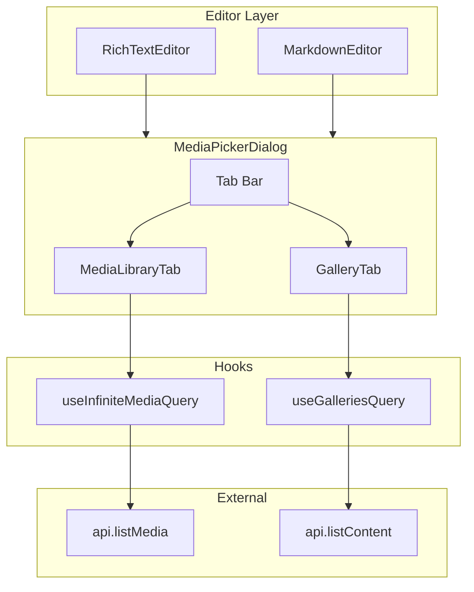

# Design Document: Media Picker Infinite Scroll

## Overview

This design replaces the existing single-page `MediaPicker` component with a tabbed, infinitely-scrolling media browser that combines media library browsing and gallery embedding into a unified dialog. The component uses `@tanstack/react-query`'s `useInfiniteQuery` hook for cursor-based pagination and the `IntersectionObserver` API for scroll-triggered pre-fetching.

The new component serves two distinct use cases from a single dialog:
1. **Media selection** — browse/search the full media library and select a single image for insertion
2. **Gallery embedding** — browse published galleries and insert a `::gallery[slug]{...}` directive

Both the TipTap-based `RichTextEditor` and CodeMirror-based `MarkdownEditor` open this picker; the props interface supports both insertion modes via a discriminated callback.

## Architecture



**Key architectural decisions:**

1. **Single component, two callbacks**: The `MediaPickerDialog` accepts both `onSelectMedia` and `onInsertGallery` callbacks. The active tab determines which callback fires. This avoids the need for two separate dialogs.

2. **Custom hooks encapsulate data fetching**: `useInfiniteMediaQuery` wraps `useInfiniteQuery` with search debouncing and cursor management. `useGalleriesQuery` wraps a standard `useQuery` for the gallery list (galleries are few enough to load in one call).

3. **Tab state lives in React state, not in the query cache**: When switching tabs, the query cache already preserves fetched pages. We keep the scroll container ref per tab so scroll position is restored by React's DOM reconciliation (hidden via `display:none` rather than unmounting).

4. **IntersectionObserver with rootMargin**: The sentinel element uses `rootMargin: '0px 0px 600px 0px'` (approximately 3 rows at ~200px per row) to trigger fetching before the user reaches the bottom.

## Components and Interfaces

### Props Interface

```typescript
interface MediaPickerDialogProps {
  isOpen: boolean;
  onClose: () => void;
  onSelectMedia?: (media: Media) => void;
  onInsertGallery?: (directive: string) => void;
  defaultTab?: 'media' | 'galleries';
}
```

**Rationale**: Both callbacks are optional. If only `onSelectMedia` is provided, the Galleries tab is still shown (useful for discoverability), but selecting a gallery calls `onInsertGallery` if present. If `onInsertGallery` is not provided, the Galleries tab can be hidden or disabled — though for this feature both are always provided by the editor wrappers.

### Component Tree

```
MediaPickerDialog
├── DialogOverlay (backdrop + focus trap)
├── DialogPanel
│   ├── Header (title + close button)
│   ├── TabBar
│   │   ├── Tab "Media Library"
│   │   └── Tab "Galleries"
│   ├── MediaLibraryPanel (visible when active)
│   │   ├── SearchInput (debounced)
│   │   ├── MediaGrid
│   │   │   ├── MediaGridItem[] (clickable thumbnails)
│   │   │   └── ScrollSentinel (IntersectionObserver target)
│   │   ├── LoadingIndicator (bottom spinner)
│   │   └── EmptyState / ErrorState
│   ├── GalleryPanel (visible when active)
│   │   ├── SearchInput (client-side filter)
│   │   ├── GalleryGrid
│   │   │   └── GalleryCard[] (featured image + title + count)
│   │   └── EmptyState
│   └── Footer (Cancel button)
```

### Custom Hooks

#### `useInfiniteMediaQuery`

```typescript
interface UseInfiniteMediaQueryOptions {
  enabled: boolean;
  pageSize?: number; // default 20
}

interface UseInfiniteMediaQueryReturn {
  items: Media[];
  isLoading: boolean;
  isFetchingNextPage: boolean;
  hasNextPage: boolean;
  fetchNextPage: () => void;
  search: string;
  setSearch: (value: string) => void;
  error: Error | null;
  refetch: () => void;
}
```

Internally uses:
- `useInfiniteQuery` with `queryKey: ['media', 'infinite', { search: debouncedSearch }]`
- `getNextPageParam: (lastPage) => lastPage.last_key ?? undefined`
- A `useState` + `useEffect` debounce (300ms) on the search string
- When `debouncedSearch` changes, the query key changes and react-query refetches from page 1

#### `useGalleriesQuery`

```typescript
interface UseGalleriesQueryReturn {
  galleries: Content[];
  isLoading: boolean;
  error: Error | null;
}
```

Wraps `useQuery` with `queryKey: ['content', 'galleries-published']` calling `api.listContent({ type: 'gallery', status: 'published' })`.

### ScrollSentinel Component

```typescript
interface ScrollSentinelProps {
  onIntersect: () => void;
  disabled: boolean;
  rootMargin?: string; // default '0px 0px 600px 0px'
}
```

Uses `useRef` + `useEffect` with `IntersectionObserver`. When `disabled` is true (no more pages or currently fetching), the observer is disconnected. The sentinel is rendered as an invisible `div` placed after the last visible grid items, positioned approximately 3 rows before the end of loaded content.

## Data Models

### API Request/Response (existing — no changes needed)

```typescript
// api.listMedia already accepts { limit?, last_key? }
// We add 'search' support:
api.listMedia({ limit: 20, last_key?: string, search?: string })
// Returns: MediaListResponse { items: Media[], last_key?: Record<string, string> }

// api.listContent already supports filters:
api.listContent({ type: 'gallery', status: 'published' })
// Returns: ContentListResponse { items: Content[], last_key?: Record<string, string> }
```

**Note**: The `listMedia` API signature needs a `search` parameter added. The backend already supports filtering by filename — we extend the API client to pass `search` as a query param.

### Updated API Client Method

```typescript
async listMedia(params?: { 
  limit?: number; 
  last_key?: string;
  search?: string;
}): Promise<MediaListResponse>
```

### Internal State Shape

```typescript
// useInfiniteQuery manages this via pages array:
// data.pages = MediaListResponse[] (one per fetched page)
// Flattened: data.pages.flatMap(page => page.items) -> Media[]

// Tab state: both panels remain mounted (display:none toggling)
// so React Query cache + DOM position are preserved automatically.
```

### Gallery Directive Format

When a gallery is selected, the directive inserted follows the existing format from `AlbumPickerDialog`:

```
::gallery[{slug}]{layout=grid limit=0 showDescription=true showTitle=true}
```

The gallery tab reuses the `EmbedConfig` pattern from the existing `AlbumPickerDialog` component.

## Correctness Properties

*A property is a characteristic or behavior that should hold true across all valid executions of a system — essentially, a formal statement about what the system should do. Properties serve as the bridge between human-readable specifications and machine-verifiable correctness guarantees.*

### Property 1: Tab State Preservation (Round-Trip)

*For any* set of media items loaded into the Media Library tab, switching to the Galleries tab and then switching back SHALL preserve the previously loaded items in their original order without triggering a refetch.

**Validates: Requirements 1.4**

### Property 2: Cursor Continuity

*For any* pagination cursor returned by a page fetch, when the scroll sentinel intersects, the next API call SHALL include exactly that cursor as the `last_key` parameter.

**Validates: Requirements 2.2**

### Property 3: Sentinel Positioning

*For any* total loaded item count and grid column count, the scroll sentinel SHALL be positioned at index `totalItems - (3 * columns)` within the rendered item list (clamped to a minimum of 0).

**Validates: Requirements 2.3**

### Property 4: Append-Only Page Accumulation

*For any* sequence of page fetches, the flattened items array SHALL equal the concatenation of all pages in fetch order — previously loaded items are never removed, reordered, or duplicated.

**Validates: Requirements 2.6**

### Property 5: Search Reset and Fetch

*For any* non-empty search string, setting that string as the search term SHALL cause the infinite query to reset (discard accumulated pages) and fetch the first page with that search term as a filter parameter.

**Validates: Requirements 3.2**

### Property 6: Debounce Coalescing

*For any* sequence of search input changes occurring within 300ms of each other, only the final value SHALL trigger an API fetch, and it SHALL occur no earlier than 300ms after the last change.

**Validates: Requirements 3.4**

### Property 7: Gallery Card Completeness

*For any* gallery content item with a title, featured_image, and metadata.media array, the rendered gallery card SHALL display the title text, the featured image, and the correct image count derived from the media array length.

**Validates: Requirements 4.2**

### Property 8: Gallery Directive Format

*For any* gallery with a valid slug and any combination of embed config options (layout, limit, showDescription, showTitle), selecting that gallery SHALL produce a directive string matching the pattern `::gallery[{slug}]{layout={layout} limit={limit} showDescription={showDescription} showTitle={showTitle}}`.

**Validates: Requirements 4.4**

### Property 9: Media Selection Callback Identity

*For any* media item rendered in the grid, clicking that item SHALL invoke the `onSelectMedia` callback with an object reference-equal to the media item from the query cache.

**Validates: Requirements 5.1**

### Property 10: Image Rendering Correctness

*For any* media item that has a `thumbnails.small` field and `dimensions`, the rendered `` element SHALL use `thumbnails.small` as its `src` attribute and SHALL include explicit `width` and `height` attributes matching the item's dimensions.

**Validates: Requirements 8.1, 8.2**

## Error Handling

| Scenario | Behavior |
|----------|----------|
| Network error on initial load | Show error message with "Retry" button; clicking retries the query |
| Network error on subsequent page | Show inline error at grid bottom with "Retry"; previously loaded items remain visible |
| Network error on gallery load | Show error message with "Retry" in the gallery panel |
| API returns 401 | Handled by existing axios interceptor (token refresh + retry) |
| Search returns empty results | Show "No media found" message; grid area is cleared |
| Gallery list empty | Show "No published galleries available" message |
| IntersectionObserver unsupported | Graceful degradation: show a "Load more" button as fallback (all modern browsers support IO) |
| Media item missing thumbnails | Fall back to `s3_url` for the image source |
| Media item is not an image | Show file icon placeholder (existing behavior from current MediaPicker) |

## Testing Strategy

### Property-Based Tests (Vitest + fast-check)

The feature's pure logic and state management lend themselves to property-based testing. We use `fast-check` as the PBT library with Vitest.

**Configuration:**
- Minimum 100 iterations per property test
- Each test tagged with: `Feature: media-picker-infinite-scroll, Property {N}: {description}`

**Properties to implement:**
1. Tab state preservation round-trip
2. Cursor continuity across page fetches
3. Sentinel positioning formula
4. Append-only page accumulation invariant
5. Search reset behavior
6. Debounce coalescing
7. Gallery card completeness
8. Gallery directive format generation
9. Media selection callback identity
10. Image rendering correctness (thumbnail + dimensions)

### Unit Tests (Vitest + React Testing Library)

Example-based tests for:
- Initial render shows two tabs with Media Library active
- Tab switching shows/hides correct panels
- Loading skeleton displayed during initial fetch
- Empty state messages for both tabs
- Escape key closes dialog
- ARIA roles correctly applied (tablist, tab, tabpanel)
- Keyboard navigation between tabs with arrow keys
- Focus trap within dialog
- ARIA live region updated on new page load
- `loading="lazy"` on all grid images
- Cancel button closes dialog
- Media hover state CSS classes applied

### Integration Tests

- Full flow: open picker -> search -> select media -> callback fires -> dialog closes
- Full flow: open picker -> switch to galleries -> select gallery -> directive inserted -> dialog closes
- Scroll simulation: render with mocked API pages, scroll to trigger sentinel, verify additional pages load
- Error recovery: simulate network failure, click retry, verify data loads

### Edge Case Tests

- API returns null `last_key` on first page (only one page of results)
- API returns zero items (empty library)
- Gallery with no featured_image (fallback placeholder)
- Network error during page fetch (error message + retry)
- Very long search strings (debounce still works)
- Rapid tab switching doesn't cause race conditions
