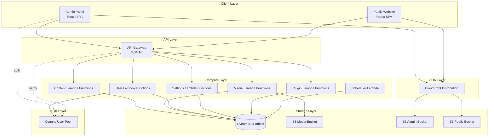
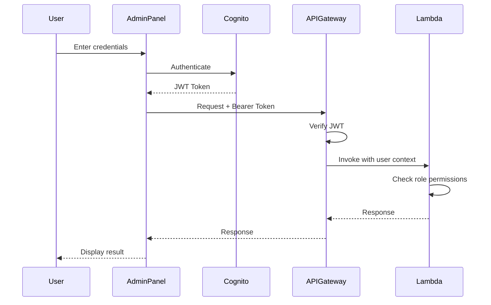

# Design Document

## Overview

The Serverless CMS System is a WordPress-equivalent content management platform built entirely on AWS serverless infrastructure. The system consists of three primary layers: a React-based Admin Panel for content management, a React-based Public Website for content delivery, and a Python Lambda backend that handles all business logic and data operations.

The architecture follows serverless best practices with stateless compute, managed services for data persistence, and CDN-based content delivery. The system is designed to be cost-effective, scalable, and maintainable while supporting extensibility through a plugin system.

## Architecture

### System Architecture Diagram



### Technology Stack

**Frontend:**
- React 18+ with TypeScript
- React Router for navigation
- TanStack Query for data fetching and caching
- Tailwind CSS for styling
- TipTap or Slate.js for rich text editing
- Prism.js for syntax highlighting

**Backend:**
- Python 3.12 Lambda functions
- Boto3 for AWS SDK
- Pillow for image processing
- PyJWT for token verification

**Infrastructure:**
- AWS CDK (TypeScript) for infrastructure as code
- DynamoDB for data persistence
- S3 for object storage
- API Gateway for HTTP routing
- Cognito for authentication
- CloudFront for CDN
- EventBridge for scheduled tasks

## Components and Interfaces

### 1. Data Layer

#### DynamoDB Tables

**Table: cms-content**
```
Partition Key: id (String)
Sort Key: type#timestamp (String)

Attributes:
- id: UUID
- type: "post" | "page" | "gallery" | "project"
- title: String
- slug: String (unique)
- content: String (HTML/Markdown)
- excerpt: String
- author: String (user-id)
- status: "draft" | "published" | "archived"
- featured_image: String (S3 URL)
- metadata: Map
  - seo_title: String
  - seo_description: String
  - tags: List<String>
  - categories: List<String>
  - custom_fields: Map (for plugin data)
- created_at: Number (Unix timestamp)
- updated_at: Number (Unix timestamp)
- published_at: Number (Unix timestamp)
- scheduled_at: Number (Unix timestamp, optional)

GSI: type-published_at-index
- Partition Key: type
- Sort Key: published_at
- Purpose: Query published content by type

GSI: slug-index
- Partition Key: slug
- Purpose: Lookup content by URL slug

GSI: status-scheduled_at-index
- Partition Key: status
- Sort Key: scheduled_at
- Purpose: Query scheduled content for publishing
```

**Table: cms-media**
```
Partition Key: id (String)

Attributes:
- id: UUID
- filename: String
- s3_key: String
- s3_url: String
- mime_type: String
- size: Number (bytes)
- dimensions: Map
  - width: Number
  - height: Number
- thumbnails: Map
  - small: String (S3 URL)
  - medium: String (S3 URL)
  - large: String (S3 URL)
- metadata: Map
  - alt_text: String
  - caption: String
  - exif: Map
- uploaded_by: String (user-id)
- uploaded_at: Number (Unix timestamp)
```

**Table: cms-users**
```
Partition Key: id (String)

Attributes:
- id: String (Cognito sub)
- email: String
- username: String
- display_name: String
- role: "admin" | "editor" | "author" | "viewer"
- avatar_url: String (S3 URL)
- bio: String
- created_at: Number (Unix timestamp)
- last_login: Number (Unix timestamp)
```

**Table: cms-settings**
```
Partition Key: key (String)

Attributes:
- key: String (e.g., "site_title", "plugin:my-plugin:config")
- value: String or Map
- updated_at: Number (Unix timestamp)
- updated_by: String (user-id)
```

**Table: cms-plugins**
```
Partition Key: id (String)

Attributes:
- id: String (plugin identifier)
- name: String
- version: String
- description: String
- author: String
- active: Boolean
- hooks: List<Map>
  - hook_name: String
  - function_arn: String
  - priority: Number
- config_schema: Map (JSON schema for settings)
- installed_at: Number (Unix timestamp)
- updated_at: Number (Unix timestamp)
```


### 2. API Layer

#### API Gateway Structure

```
/api/v1
├── /content
│   ├── POST /                    # Create content
│   ├── GET /{id}                 # Get content by ID
│   ├── PUT /{id}                 # Update content
│   ├── DELETE /{id}              # Delete content
│   ├── GET /                     # List content (with filters)
│   └── GET /slug/{slug}          # Get content by slug
├── /media
│   ├── POST /upload              # Upload media
│   ├── GET /{id}                 # Get media metadata
│   ├── DELETE /{id}              # Delete media
│   └── GET /                     # List media
├── /users
│   ├── GET /me                   # Get current user
│   ├── PUT /me                   # Update current user
│   └── GET /                     # List users (admin only)
├── /settings
│   ├── GET /                     # Get all settings
│   └── PUT /                     # Update settings
└── /plugins
    ├── POST /install             # Install plugin
    ├── POST /{id}/activate       # Activate plugin
    ├── POST /{id}/deactivate     # Deactivate plugin
    ├── GET /                     # List plugins
    ├── GET /{id}/settings        # Get plugin settings
    └── PUT /{id}/settings        # Update plugin settings
```

#### Authentication Flow



### 3. Lambda Functions

#### Shared Layer Structure

```python
# lambda/shared/auth.py
import jwt
import os
from functools import wraps
from typing import Tuple, List

COGNITO_REGION = os.environ['COGNITO_REGION']
USER_POOL_ID = os.environ['USER_POOL_ID']

def verify_token(token: str) -> Tuple[str, str]:
    """
    Verify Cognito JWT token and extract user info.
    Returns: (user_id, role)
    """
    # Verify JWT signature with Cognito public keys
    # Extract user_id from 'sub' claim
    # Fetch role from DynamoDB users table
    pass

def require_auth(roles: List[str] = None):
    """
    Decorator to require authentication and optionally specific roles.
    """
    def decorator(func):
        @wraps(func)
        def wrapper(event, context):
            auth_header = event.get('headers', {}).get('Authorization', '')
            if not auth_header.startswith('Bearer '):
                return {
                    'statusCode': 401,
                    'body': json.dumps({'error': 'Unauthorized'})
                }
            
            token = auth_header.replace('Bearer ', '')
            try:
                user_id, role = verify_token(token)
            except Exception as e:
                return {
                    'statusCode': 401,
                    'body': json.dumps({'error': 'Invalid token'})
                }
            
            if roles and role not in roles:
                return {
                    'statusCode': 403,
                    'body': json.dumps({'error': 'Forbidden'})
                }
            
            return func(event, context, user_id, role)
        return wrapper
    return decorator
```

```python
# lambda/shared/db.py
import boto3
from boto3.dynamodb.conditions import Key, Attr
from typing import Dict, List, Any
import os

dynamodb = boto3.resource('dynamodb')

class ContentRepository:
    def __init__(self):
        self.table = dynamodb.Table(os.environ['CONTENT_TABLE'])
    
    def create(self, item: Dict[str, Any]) -> Dict[str, Any]:
        """Create a new content item."""
        self.table.put_item(Item=item)
        return item
    
    def get_by_id(self, content_id: str) -> Dict[str, Any]:
        """Get content by ID."""
        response = self.table.get_item(Key={'id': content_id})
        return response.get('Item')
    
    def get_by_slug(self, slug: str) -> Dict[str, Any]:
        """Get content by slug using GSI."""
        response = self.table.query(
            IndexName='slug-index',
            KeyConditionExpression=Key('slug').eq(slug)
        )
        items = response.get('Items', [])
        return items[0] if items else None
    
    def list_by_type(self, content_type: str, status: str = 'published', 
                     limit: int = 20, last_key: Dict = None) -> Dict:
        """List content by type with pagination."""
        query_params = {
            'IndexName': 'type-published_at-index',
            'KeyConditionExpression': Key('type').eq(content_type),
            'ScanIndexForward': False,
            'Limit': limit
        }
        
        if status:
            query_params['FilterExpression'] = Attr('status').eq(status)
        
        if last_key:
            query_params['ExclusiveStartKey'] = last_key
        
        response = self.table.query(**query_params)
        return {
            'items': response.get('Items', []),
            'last_key': response.get('LastEvaluatedKey')
        }
    
    def update(self, content_id: str, updates: Dict[str, Any]) -> Dict[str, Any]:
        """Update content item."""
        # Build update expression dynamically
        update_expr = "SET " + ", ".join([f"#{k} = :{k}" for k in updates.keys()])
        expr_attr_names = {f"#{k}": k for k in updates.keys()}
        expr_attr_values = {f":{k}": v for k, v in updates.items()}
        
        response = self.table.update_item(
            Key={'id': content_id},
            UpdateExpression=update_expr,
            ExpressionAttributeNames=expr_attr_names,
            ExpressionAttributeValues=expr_attr_values,
            ReturnValues='ALL_NEW'
        )
        return response.get('Attributes')
    
    def delete(self, content_id: str):
        """Delete content item."""
        self.table.delete_item(Key={'id': content_id})
    
    def get_scheduled_content(self, current_time: int) -> List[Dict[str, Any]]:
        """Get content scheduled for publication."""
        response = self.table.query(
            IndexName='status-scheduled_at-index',
            KeyConditionExpression=Key('status').eq('draft') & Key('scheduled_at').lte(current_time)
        )
        return response.get('Items', [])
```

```python
# lambda/shared/s3.py
import boto3
from PIL import Image
import io
import os
from typing import Tuple, Dict

s3 = boto3.client('s3')
MEDIA_BUCKET = os.environ['MEDIA_BUCKET']

def upload_file(file_data: bytes, filename: str, content_type: str) -> str:
    """Upload file to S3 and return URL."""
    key = f"uploads/{filename}"
    s3.put_object(
        Bucket=MEDIA_BUCKET,
        Key=key,
        Body=file_data,
        ContentType=content_type
    )
    return f"https://{MEDIA_BUCKET}.s3.amazonaws.com/{key}"

def generate_thumbnails(s3_key: str) -> Dict[str, str]:
    """Generate thumbnails for an image."""
    # Get original image
    obj = s3.get_object(Bucket=MEDIA_BUCKET, Key=s3_key)
    img = Image.open(io.BytesIO(obj['Body'].read()))
    
    sizes = {
        'small': (300, 300),
        'medium': (600, 600),
        'large': (1200, 1200)
    }
    
    thumbnails = {}
    for size_name, dimensions in sizes.items():
        # Create thumbnail
        thumb = img.copy()
        thumb.thumbnail(dimensions, Image.Resampling.LANCZOS)
        
        # Save to buffer
        buffer = io.BytesIO()
        thumb.save(buffer, format='JPEG', quality=85)
        buffer.seek(0)
        
        # Upload thumbnail
        thumb_key = s3_key.replace('uploads/', f'thumbnails/{size_name}/')
        s3.put_object(
            Bucket=MEDIA_BUCKET,
            Key=thumb_key,
            Body=buffer,
            ContentType='image/jpeg'
        )
        
        thumbnails[size_name] = f"https://{MEDIA_BUCKET}.s3.amazonaws.com/{thumb_key}"
    
    return thumbnails

def delete_file(s3_key: str):
    """Delete file and all thumbnails from S3."""
    # Delete original
    s3.delete_object(Bucket=MEDIA_BUCKET, Key=s3_key)
    
    # Delete thumbnails
    for size in ['small', 'medium', 'large']:
        thumb_key = s3_key.replace('uploads/', f'thumbnails/{size}/')
        try:
            s3.delete_object(Bucket=MEDIA_BUCKET, Key=thumb_key)
        except:
            pass
```


```python
# lambda/shared/plugins.py
import boto3
import json
from typing import List, Dict, Any
import os

dynamodb = boto3.resource('dynamodb')
lambda_client = boto3.client('lambda')

class PluginManager:
    def __init__(self):
        self.plugins_table = dynamodb.Table(os.environ['PLUGINS_TABLE'])
        self._hook_cache = {}
    
    def get_active_plugins(self) -> List[Dict[str, Any]]:
        """Get all active plugins."""
        response = self.plugins_table.scan(
            FilterExpression='active = :true',
            ExpressionAttributeValues={':true': True}
        )
        return response.get('Items', [])
    
    def execute_hook(self, hook_name: str, data: Any) -> Any:
        """Execute all plugin functions registered for a hook."""
        plugins = self.get_active_plugins()
        
        # Get all functions for this hook, sorted by priority
        hook_functions = []
        for plugin in plugins:
            for hook in plugin.get('hooks', []):
                if hook['hook_name'] == hook_name:
                    hook_functions.append({
                        'function_arn': hook['function_arn'],
                        'priority': hook.get('priority', 10)
                    })
        
        # Sort by priority (lower number = higher priority)
        hook_functions.sort(key=lambda x: x['priority'])
        
        # Execute each function in order
        result = data
        for hook_func in hook_functions:
            try:
                response = lambda_client.invoke(
                    FunctionName=hook_func['function_arn'],
                    InvocationType='RequestResponse',
                    Payload=json.dumps({'hook': hook_name, 'data': result})
                )
                payload = json.loads(response['Payload'].read())
                if payload.get('statusCode') == 200:
                    result = json.loads(payload['body'])
            except Exception as e:
                # Log error but continue
                print(f"Plugin hook error: {e}")
                continue
        
        return result
    
    def apply_content_filters(self, content: str, content_type: str) -> str:
        """Apply content filter hooks."""
        return self.execute_hook(f'content_render_{content_type}', content)
```

#### Content Lambda Functions

```python
# lambda/content/create.py
import json
import uuid
from datetime import datetime
from shared.auth import require_auth
from shared.db import ContentRepository
from shared.plugins import PluginManager

content_repo = ContentRepository()
plugin_manager = PluginManager()

@require_auth(roles=['admin', 'editor', 'author'])
def handler(event, context, user_id, role):
    """Create new content item."""
    try:
        body = json.loads(event['body'])
        
        # Validate required fields
        if not body.get('title') or not body.get('content'):
            return {
                'statusCode': 400,
                'body': json.dumps({'error': 'Title and content are required'})
            }
        
        # Check slug uniqueness
        slug = body.get('slug', body['title'].lower().replace(' ', '-'))
        existing = content_repo.get_by_slug(slug)
        if existing:
            return {
                'statusCode': 409,
                'body': json.dumps({'error': 'Slug already exists'})
            }
        
        # Create content item
        now = int(datetime.now().timestamp())
        content_item = {
            'id': str(uuid.uuid4()),
            'type': body.get('type', 'post'),
            'title': body['title'],
            'slug': slug,
            'content': body['content'],
            'excerpt': body.get('excerpt', ''),
            'author': user_id,
            'status': body.get('status', 'draft'),
            'featured_image': body.get('featured_image', ''),
            'metadata': body.get('metadata', {}),
            'created_at': now,
            'updated_at': now
        }
        
        # Set published_at if status is published
        if content_item['status'] == 'published':
            content_item['published_at'] = now
        
        # Set scheduled_at if provided
        if body.get('scheduled_at'):
            content_item['scheduled_at'] = body['scheduled_at']
        
        # Execute plugin hook
        content_item = plugin_manager.execute_hook('content_create', content_item)
        
        # Save to database
        result = content_repo.create(content_item)
        
        return {
            'statusCode': 201,
            'headers': {'Content-Type': 'application/json'},
            'body': json.dumps(result)
        }
    
    except Exception as e:
        return {
            'statusCode': 500,
            'body': json.dumps({'error': str(e)})
        }
```

```python
# lambda/content/get.py
import json
from shared.db import ContentRepository
from shared.plugins import PluginManager

content_repo = ContentRepository()
plugin_manager = PluginManager()

def handler(event, context):
    """Get content by ID."""
    try:
        content_id = event['pathParameters']['id']
        
        # Get content
        content = content_repo.get_by_id(content_id)
        if not content:
            return {
                'statusCode': 404,
                'body': json.dumps({'error': 'Content not found'})
            }
        
        # Check if user can view draft content
        if content['status'] == 'draft':
            # Require authentication for drafts
            auth_header = event.get('headers', {}).get('Authorization', '')
            if not auth_header:
                return {
                    'statusCode': 403,
                    'body': json.dumps({'error': 'Draft content requires authentication'})
                }
        
        # Apply content filters
        content['content'] = plugin_manager.apply_content_filters(
            content['content'], 
            content['type']
        )
        
        return {
            'statusCode': 200,
            'headers': {'Content-Type': 'application/json'},
            'body': json.dumps(content)
        }
    
    except Exception as e:
        return {
            'statusCode': 500,
            'body': json.dumps({'error': str(e)})
        }
```

```python
# lambda/content/list.py
import json
from shared.db import ContentRepository

content_repo = ContentRepository()

def handler(event, context):
    """List content with filters."""
    try:
        params = event.get('queryStringParameters', {}) or {}
        
        content_type = params.get('type', 'post')
        status = params.get('status', 'published')
        limit = int(params.get('limit', 20))
        last_key = params.get('last_key')
        
        # Parse last_key if provided
        if last_key:
            last_key = json.loads(last_key)
        
        # Get content
        result = content_repo.list_by_type(
            content_type=content_type,
            status=status,
            limit=limit,
            last_key=last_key
        )
        
        return {
            'statusCode': 200,
            'headers': {'Content-Type': 'application/json'},
            'body': json.dumps({
                'items': result['items'],
                'last_key': result['last_key']
            })
        }
    
    except Exception as e:
        return {
            'statusCode': 500,
            'body': json.dumps({'error': str(e)})
        }
```

#### Scheduler Lambda Function

```python
# lambda/scheduler/publish_scheduled.py
from datetime import datetime
from shared.db import ContentRepository

content_repo = ContentRepository()

def handler(event, context):
    """Publish scheduled content."""
    try:
        current_time = int(datetime.now().timestamp())
        
        # Get scheduled content
        scheduled_items = content_repo.get_scheduled_content(current_time)
        
        published_count = 0
        for item in scheduled_items:
            # Update status to published
            content_repo.update(item['id'], {
                'status': 'published',
                'published_at': current_time,
                'updated_at': current_time
            })
            published_count += 1
        
        return {
            'statusCode': 200,
            'body': f"Published {published_count} scheduled items"
        }
    
    except Exception as e:
        print(f"Error publishing scheduled content: {e}")
        return {
            'statusCode': 500,
            'body': str(e)
        }
```

### 4. Frontend Architecture

#### Admin Panel Structure

```
admin-panel/
├── src/
│   ├── components/
│   │   ├── Layout/
│   │   │   ├── AdminLayout.tsx       # Main layout with sidebar
│   │   │   ├── Sidebar.tsx           # Navigation sidebar
│   │   │   └── Header.tsx            # Top header with user menu
│   │   ├── Editor/
│   │   │   ├── RichTextEditor.tsx    # TipTap editor component
│   │   │   ├── MarkdownEditor.tsx    # Markdown editor option
│   │   │   ├── MediaPicker.tsx       # Media selection modal
│   │   │   └── EditorToolbar.tsx     # Formatting toolbar
│   │   ├── MediaLibrary/
│   │   │   ├── MediaGrid.tsx         # Grid view of media
│   │   │   ├── MediaUpload.tsx       # Drag & drop upload
│   │   │   ├── MediaItem.tsx         # Single media item card
│   │   │   └── MediaModal.tsx        # Edit media metadata
│   │   ├── ContentList/
│   │   │   ├── ContentTable.tsx      # Table of content items
│   │   │   ├── ContentFilters.tsx    # Filter controls
│   │   │   └── ContentActions.tsx    # Bulk actions
│   │   └── Common/
│   │       ├── Button.tsx
│   │       ├── Input.tsx
│   │       ├── Select.tsx
│   │       └── Modal.tsx
│   ├── pages/
│   │   ├── Dashboard.tsx             # Overview dashboard
│   │   ├── ContentList.tsx           # List all content
│   │   ├── ContentEditor.tsx         # Create/edit content
│   │   ├── MediaLibrary.tsx          # Media management
│   │   ├── Settings.tsx              # Site settings
│   │   ├── Plugins.tsx               # Plugin management
│   │   └── Login.tsx                 # Authentication
│   ├── hooks/
│   │   ├── useAuth.ts                # Authentication hook
│   │   ├── useContent.ts             # Content CRUD operations
│   │   ├── useMedia.ts               # Media operations
│   │   └── usePlugins.ts             # Plugin operations
│   ├── services/
│   │   ├── api.ts                    # API client
│   │   ├── auth.ts                   # Cognito integration
│   │   └── storage.ts                # Local storage utilities
│   ├── types/
│   │   ├── content.ts
│   │   ├── media.ts
│   │   ├── user.ts
│   │   └── plugin.ts
│   └── App.tsx
```


#### Key React Components

**Content Editor Component:**
```typescript
// admin-panel/src/components/Editor/RichTextEditor.tsx
import { useEditor, EditorContent } from '@tiptap/react';
import StarterKit from '@tiptap/starter-kit';
import Image from '@tiptap/extension-image';
import CodeBlock from '@tiptap/extension-code-block';

interface RichTextEditorProps {
  content: string;
  onChange: (content: string) => void;
  onMediaInsert: () => void;
}

export const RichTextEditor: React.FC<RichTextEditorProps> = ({
  content,
  onChange,
  onMediaInsert
}) => {
  const editor = useEditor({
    extensions: [
      StarterKit,
      Image,
      CodeBlock.configure({
        HTMLAttributes: {
          class: 'code-block',
        },
      }),
    ],
    content,
    onUpdate: ({ editor }) => {
      onChange(editor.getHTML());
    },
  });

  return (
    <div className="editor-container">
      <EditorToolbar editor={editor} onMediaInsert={onMediaInsert} />
      <EditorContent editor={editor} className="prose max-w-none" />
    </div>
  );
};
```

**Content Hook:**
```typescript
// admin-panel/src/hooks/useContent.ts
import { useMutation, useQuery, useQueryClient } from '@tanstack/react-query';
import { api } from '../services/api';
import { Content, ContentCreate, ContentUpdate } from '../types/content';

export const useContent = (id?: string) => {
  const queryClient = useQueryClient();

  const { data: content, isLoading } = useQuery({
    queryKey: ['content', id],
    queryFn: () => api.getContent(id!),
    enabled: !!id,
  });

  const createMutation = useMutation({
    mutationFn: (data: ContentCreate) => api.createContent(data),
    onSuccess: () => {
      queryClient.invalidateQueries({ queryKey: ['content'] });
    },
  });

  const updateMutation = useMutation({
    mutationFn: ({ id, data }: { id: string; data: ContentUpdate }) =>
      api.updateContent(id, data),
    onSuccess: () => {
      queryClient.invalidateQueries({ queryKey: ['content'] });
    },
  });

  const deleteMutation = useMutation({
    mutationFn: (id: string) => api.deleteContent(id),
    onSuccess: () => {
      queryClient.invalidateQueries({ queryKey: ['content'] });
    },
  });

  return {
    content,
    isLoading,
    create: createMutation.mutate,
    update: updateMutation.mutate,
    delete: deleteMutation.mutate,
  };
};

export const useContentList = (filters: ContentFilters) => {
  return useQuery({
    queryKey: ['content', 'list', filters],
    queryFn: () => api.listContent(filters),
  });
};
```

#### Public Website Structure

```
public-website/
├── src/
│   ├── components/
│   │   ├── Layout/
│   │   │   ├── Header.tsx            # Site header with navigation
│   │   │   ├── Footer.tsx            # Site footer
│   │   │   └── Layout.tsx            # Main layout wrapper
│   │   ├── PostCard.tsx              # Blog post preview card
│   │   ├── Gallery.tsx               # Photo gallery grid
│   │   ├── Lightbox.tsx              # Image lightbox viewer
│   │   ├── CodeBlock.tsx             # Syntax highlighted code
│   │   └── Navigation.tsx            # Main navigation menu
│   ├── pages/
│   │   ├── Home.tsx                  # Homepage
│   │   ├── Blog.tsx                  # Blog listing
│   │   ├── Post.tsx                  # Single post view
│   │   ├── Gallery.tsx               # Gallery page
│   │   ├── Projects.tsx              # Projects showcase
│   │   └── About.tsx                 # About page
│   ├── hooks/
│   │   ├── useContent.ts             # Fetch content
│   │   └── useSiteSettings.ts        # Fetch site settings
│   ├── services/
│   │   └── api.ts                    # API client
│   └── App.tsx
```

**Post Display Component:**
```typescript
// public-website/src/pages/Post.tsx
import { useParams } from 'react-router-dom';
import { useQuery } from '@tanstack/react-query';
import { api } from '../services/api';
import { CodeBlock } from '../components/CodeBlock';
import { Helmet } from 'react-helmet-async';

export const Post: React.FC = () => {
  const { slug } = useParams<{ slug: string }>();
  
  const { data: post, isLoading } = useQuery({
    queryKey: ['post', slug],
    queryFn: () => api.getContentBySlug(slug!),
  });

  if (isLoading) return <div>Loading...</div>;
  if (!post) return <div>Post not found</div>;

  return (
    <>
      <Helmet>
        <title>{post.metadata.seo_title || post.title}</title>
        <meta 
          name="description" 
          content={post.metadata.seo_description || post.excerpt} 
        />
      </Helmet>
      
      <article className="max-w-4xl mx-auto px-4 py-8">
        <header className="mb-8">
          <h1 className="text-4xl font-bold mb-4">{post.title}</h1>
          <div className="text-gray-600">
            By {post.author} • {new Date(post.published_at * 1000).toLocaleDateString()}
          </div>
          {post.metadata.tags && (
            <div className="flex gap-2 mt-4">
              {post.metadata.tags.map(tag => (
                <span key={tag} className="px-3 py-1 bg-gray-200 rounded">
                  {tag}
                </span>
              ))}
            </div>
          )}
        </header>
        
        {post.featured_image && (
          
        )}
        
        <div 
          className="prose prose-lg max-w-none"
          dangerouslySetInnerHTML={{ __html: post.content }}
        />
      </article>
    </>
  );
};
```

## Data Models

### TypeScript Interfaces

```typescript
// Shared types
export interface Content {
  id: string;
  type: 'post' | 'page' | 'gallery' | 'project';
  title: string;
  slug: string;
  content: string;
  excerpt: string;
  author: string;
  status: 'draft' | 'published' | 'archived';
  featured_image?: string;
  metadata: {
    seo_title?: string;
    seo_description?: string;
    tags?: string[];
    categories?: string[];
    custom_fields?: Record<string, any>;
  };
  created_at: number;
  updated_at: number;
  published_at?: number;
  scheduled_at?: number;
}

export interface Media {
  id: string;
  filename: string;
  s3_key: string;
  s3_url: string;
  mime_type: string;
  size: number;
  dimensions?: {
    width: number;
    height: number;
  };
  thumbnails?: {
    small: string;
    medium: string;
    large: string;
  };
  metadata: {
    alt_text?: string;
    caption?: string;
    exif?: Record<string, any>;
  };
  uploaded_by: string;
  uploaded_at: number;
}

export interface User {
  id: string;
  email: string;
  username: string;
  display_name: string;
  role: 'admin' | 'editor' | 'author' | 'viewer';
  avatar_url?: string;
  bio?: string;
  created_at: number;
  last_login: number;
}

export interface Plugin {
  id: string;
  name: string;
  version: string;
  description: string;
  author: string;
  active: boolean;
  hooks: PluginHook[];
  config_schema?: Record<string, any>;
  installed_at: number;
  updated_at: number;
}

export interface PluginHook {
  hook_name: string;
  function_arn: string;
  priority: number;
}

export interface SiteSettings {
  site_title: string;
  site_description: string;
  theme: string;
  [key: string]: any;
}
```

## Plugin System Design

### Plugin Architecture

Plugins extend the system through a hook-based architecture. Each plugin can:
1. Register Lambda functions that respond to specific hooks
2. Add custom fields to content metadata
3. Transform content during rendering
4. Add UI components to the Admin Panel

### Plugin Structure

```
my-plugin/
├── plugin.json                 # Plugin metadata
├── lambda/
│   ├── content_filter.py       # Hook function for content filtering
│   └── requirements.txt
├── admin-ui/
│   ├── PluginSettings.tsx      # Settings UI component
│   └── ContentExtension.tsx    # Editor extension
└── README.md
```

**plugin.json:**
```json
{
  "id": "syntax-highlighter-pro",
  "name": "Syntax Highlighter Pro",
  "version": "1.0.0",
  "description": "Enhanced syntax highlighting for code blocks",
  "author": "Your Name",
  "hooks": [
    {
      "hook_name": "content_render_post",
      "handler": "lambda/content_filter.handler",
      "priority": 5
    },
    {
      "hook_name": "content_render_project",
      "handler": "lambda/content_filter.handler",
      "priority": 5
    }
  ],
  "config_schema": {
    "type": "object",
    "properties": {
      "theme": {
        "type": "string",
        "enum": ["monokai", "github", "dracula"],
        "default": "monokai"
      },
      "line_numbers": {
        "type": "boolean",
        "default": true
      }
    }
  }
}
```

**Plugin Lambda Function:**
```python
# my-plugin/lambda/content_filter.py
import json
import re
from pygments import highlight
from pygments.lexers import get_lexer_by_name
from pygments.formatters import HtmlFormatter

def handler(event, context):
    """Transform code blocks with enhanced syntax highlighting."""
    try:
        hook = event['hook']
        content = event['data']
        
        # Get plugin settings
        settings = get_plugin_settings('syntax-highlighter-pro')
        theme = settings.get('theme', 'monokai')
        line_numbers = settings.get('line_numbers', True)
        
        # Find all code blocks
        code_pattern = r'<pre><code class="language-(\w+)">(.*?)</code></pre>'
        
        def replace_code_block(match):
            language = match.group(1)
            code = match.group(2)
            
            try:
                lexer = get_lexer_by_name(language)
                formatter = HtmlFormatter(
                    style=theme,
                    linenos='table' if line_numbers else False,
                    cssclass='highlight'
                )
                highlighted = highlight(code, lexer, formatter)
                return highlighted
            except:
                return match.group(0)
        
        # Replace all code blocks
        transformed_content = re.sub(
            code_pattern,
            replace_code_block,
            content,
            flags=re.DOTALL
        )
        
        return {
            'statusCode': 200,
            'body': json.dumps(transformed_content)
        }
    
    except Exception as e:
        return {
            'statusCode': 500,
            'body': json.dumps(str(e))
        }
```

### Available Hooks

```typescript
// Content Hooks
'content_create'          // Before content is saved
'content_update'          // Before content is updated
'content_delete'          // Before content is deleted
'content_render_post'     // Transform post content before display
'content_render_page'     // Transform page content before display
'content_render_gallery'  // Transform gallery content before display
'content_render_project'  // Transform project content before display

// Media Hooks
'media_upload'            // After media is uploaded
'media_delete'            // Before media is deleted
'thumbnail_generate'      // Customize thumbnail generation

// Admin Panel Hooks
'editor_toolbar'          // Add buttons to editor toolbar
'content_fields'          // Add custom fields to content editor
'settings_page'           // Add settings sections
```


## Error Handling

### Error Response Format

All API endpoints return errors in a consistent format:

```json
{
  "error": "Error message",
  "code": "ERROR_CODE",
  "details": {}
}
```

### Error Codes

```typescript
enum ErrorCode {
  // Authentication errors (401)
  UNAUTHORIZED = 'UNAUTHORIZED',
  INVALID_TOKEN = 'INVALID_TOKEN',
  TOKEN_EXPIRED = 'TOKEN_EXPIRED',
  
  // Authorization errors (403)
  FORBIDDEN = 'FORBIDDEN',
  INSUFFICIENT_PERMISSIONS = 'INSUFFICIENT_PERMISSIONS',
  
  // Validation errors (400)
  INVALID_INPUT = 'INVALID_INPUT',
  MISSING_REQUIRED_FIELD = 'MISSING_REQUIRED_FIELD',
  INVALID_SLUG = 'INVALID_SLUG',
  
  // Resource errors (404)
  NOT_FOUND = 'NOT_FOUND',
  CONTENT_NOT_FOUND = 'CONTENT_NOT_FOUND',
  MEDIA_NOT_FOUND = 'MEDIA_NOT_FOUND',
  
  // Conflict errors (409)
  DUPLICATE_SLUG = 'DUPLICATE_SLUG',
  RESOURCE_CONFLICT = 'RESOURCE_CONFLICT',
  
  // Server errors (500)
  INTERNAL_ERROR = 'INTERNAL_ERROR',
  DATABASE_ERROR = 'DATABASE_ERROR',
  S3_ERROR = 'S3_ERROR',
  PLUGIN_ERROR = 'PLUGIN_ERROR'
}
```

### Lambda Error Handling Pattern

```python
# Standardized error handling in Lambda functions
import json
import traceback

def create_error_response(status_code: int, error_code: str, message: str, details: dict = None):
    """Create standardized error response."""
    return {
        'statusCode': status_code,
        'headers': {
            'Content-Type': 'application/json',
            'Access-Control-Allow-Origin': '*'
        },
        'body': json.dumps({
            'error': message,
            'code': error_code,
            'details': details or {}
        })
    }

def handler(event, context):
    try:
        # Business logic here
        pass
    except ValueError as e:
        return create_error_response(400, 'INVALID_INPUT', str(e))
    except KeyError as e:
        return create_error_response(400, 'MISSING_REQUIRED_FIELD', f'Missing field: {e}')
    except Exception as e:
        # Log full traceback for debugging
        print(f"Unexpected error: {traceback.format_exc()}")
        return create_error_response(500, 'INTERNAL_ERROR', 'An unexpected error occurred')
```

### Frontend Error Handling

```typescript
// admin-panel/src/services/api.ts
import axios, { AxiosError } from 'axios';

export class ApiError extends Error {
  constructor(
    public statusCode: number,
    public code: string,
    message: string,
    public details?: any
  ) {
    super(message);
    this.name = 'ApiError';
  }
}

const apiClient = axios.create({
  baseURL: process.env.REACT_APP_API_URL,
});

// Request interceptor for auth token
apiClient.interceptors.request.use((config) => {
  const token = localStorage.getItem('auth_token');
  if (token) {
    config.headers.Authorization = `Bearer ${token}`;
  }
  return config;
});

// Response interceptor for error handling
apiClient.interceptors.response.use(
  (response) => response,
  (error: AxiosError) => {
    if (error.response) {
      const { status, data } = error.response;
      throw new ApiError(
        status,
        data.code || 'UNKNOWN_ERROR',
        data.error || 'An error occurred',
        data.details
      );
    }
    throw new ApiError(0, 'NETWORK_ERROR', 'Network error occurred');
  }
);

export const api = {
  // Content operations
  async createContent(data: ContentCreate): Promise<Content> {
    const response = await apiClient.post('/content', data);
    return response.data;
  },
  
  async getContent(id: string): Promise<Content> {
    const response = await apiClient.get(`/content/${id}`);
    return response.data;
  },
  
  // ... other methods
};
```

## Testing Strategy

### Unit Testing

**Lambda Functions:**
```python
# tests/test_content_create.py
import pytest
import json
from unittest.mock import Mock, patch
from lambda.content.create import handler

@pytest.fixture
def mock_event():
    return {
        'headers': {
            'Authorization': 'Bearer valid_token'
        },
        'body': json.dumps({
            'title': 'Test Post',
            'content': 'Test content',
            'type': 'post',
            'status': 'draft'
        })
    }

@pytest.fixture
def mock_context():
    return Mock()

@patch('lambda.content.create.content_repo')
@patch('lambda.content.create.verify_token')
def test_create_content_success(mock_verify, mock_repo, mock_event, mock_context):
    # Setup mocks
    mock_verify.return_value = ('user-123', 'author')
    mock_repo.get_by_slug.return_value = None
    mock_repo.create.return_value = {'id': 'content-123'}
    
    # Execute
    response = handler(mock_event, mock_context)
    
    # Assert
    assert response['statusCode'] == 201
    body = json.loads(response['body'])
    assert body['id'] == 'content-123'
    mock_repo.create.assert_called_once()

@patch('lambda.content.create.content_repo')
@patch('lambda.content.create.verify_token')
def test_create_content_duplicate_slug(mock_verify, mock_repo, mock_event, mock_context):
    # Setup mocks
    mock_verify.return_value = ('user-123', 'author')
    mock_repo.get_by_slug.return_value = {'id': 'existing-123'}
    
    # Execute
    response = handler(mock_event, mock_context)
    
    # Assert
    assert response['statusCode'] == 409
    body = json.loads(response['body'])
    assert body['error'] == 'Slug already exists'
```

**React Components:**
```typescript
// admin-panel/src/components/Editor/__tests__/RichTextEditor.test.tsx
import { render, screen, fireEvent } from '@testing-library/react';
import { RichTextEditor } from '../RichTextEditor';

describe('RichTextEditor', () => {
  it('renders editor with initial content', () => {
    const onChange = jest.fn();
    render(
      <RichTextEditor 
        content="<p>Initial content</p>" 
        onChange={onChange}
        onMediaInsert={jest.fn()}
      />
    );
    
    expect(screen.getByText('Initial content')).toBeInTheDocument();
  });
  
  it('calls onChange when content is modified', async () => {
    const onChange = jest.fn();
    render(
      <RichTextEditor 
        content="" 
        onChange={onChange}
        onMediaInsert={jest.fn()}
      />
    );
    
    // Simulate typing
    const editor = screen.getByRole('textbox');
    fireEvent.input(editor, { target: { innerHTML: '<p>New content</p>' } });
    
    expect(onChange).toHaveBeenCalled();
  });
});
```

### Integration Testing

**API Integration Tests:**
```python
# tests/integration/test_content_api.py
import pytest
import requests
import json

API_BASE_URL = 'https://api.example.com/api/v1'

@pytest.fixture
def auth_token():
    # Get auth token from Cognito
    response = requests.post(f'{API_BASE_URL}/auth/login', json={
        'email': 'test@example.com',
        'password': 'TestPassword123!'
    })
    return response.json()['token']

def test_content_lifecycle(auth_token):
    headers = {'Authorization': f'Bearer {auth_token}'}
    
    # Create content
    create_response = requests.post(
        f'{API_BASE_URL}/content',
        headers=headers,
        json={
            'title': 'Integration Test Post',
            'content': 'Test content',
            'type': 'post',
            'status': 'draft'
        }
    )
    assert create_response.status_code == 201
    content_id = create_response.json()['id']
    
    # Get content
    get_response = requests.get(
        f'{API_BASE_URL}/content/{content_id}',
        headers=headers
    )
    assert get_response.status_code == 200
    assert get_response.json()['title'] == 'Integration Test Post'
    
    # Update content
    update_response = requests.put(
        f'{API_BASE_URL}/content/{content_id}',
        headers=headers,
        json={'status': 'published'}
    )
    assert update_response.status_code == 200
    
    # Delete content
    delete_response = requests.delete(
        f'{API_BASE_URL}/content/{content_id}',
        headers=headers
    )
    assert delete_response.status_code == 200
```

### End-to-End Testing

**Playwright E2E Tests:**
```typescript
// e2e/content-management.spec.ts
import { test, expect } from '@playwright/test';

test.describe('Content Management', () => {
  test.beforeEach(async ({ page }) => {
    // Login
    await page.goto('https://admin.example.com/login');
    await page.fill('input[name="email"]', 'test@example.com');
    await page.fill('input[name="password"]', 'TestPassword123!');
    await page.click('button[type="submit"]');
    await page.waitForURL('**/admin/dashboard');
  });
  
  test('create and publish blog post', async ({ page }) => {
    // Navigate to content editor
    await page.click('text=New Post');
    await page.waitForURL('**/admin/content/new');
    
    // Fill in content
    await page.fill('input[name="title"]', 'E2E Test Post');
    await page.fill('textarea[name="excerpt"]', 'Test excerpt');
    
    // Use rich text editor
    const editor = page.locator('.ProseMirror');
    await editor.click();
    await editor.type('This is test content');
    
    // Save as draft
    await page.click('button:has-text("Save Draft")');
    await expect(page.locator('text=Draft saved')).toBeVisible();
    
    // Publish
    await page.click('button:has-text("Publish")');
    await expect(page.locator('text=Published successfully')).toBeVisible();
    
    // Verify on public site
    const slug = await page.locator('input[name="slug"]').inputValue();
    await page.goto(`https://example.com/blog/${slug}`);
    await expect(page.locator('h1')).toHaveText('E2E Test Post');
  });
});
```

## Performance Considerations

### Caching Strategy

**CloudFront Caching:**
```typescript
// CDK configuration for CloudFront caching
const distribution = new cloudfront.Distribution(this, 'Distribution', {
  defaultBehavior: {
    origin: new origins.S3Origin(publicBucket),
    viewerProtocolPolicy: cloudfront.ViewerProtocolPolicy.REDIRECT_TO_HTTPS,
    cachePolicy: new cloudfront.CachePolicy(this, 'CachePolicy', {
      defaultTtl: Duration.hours(24),
      maxTtl: Duration.days(7),
      minTtl: Duration.seconds(0),
      queryStringBehavior: cloudfront.CacheQueryStringBehavior.all(),
    }),
  },
  additionalBehaviors: {
    '/api/*': {
      origin: new origins.HttpOrigin(apiGateway.url),
      cachePolicy: cloudfront.CachePolicy.CACHING_DISABLED,
      allowedMethods: cloudfront.AllowedMethods.ALLOW_ALL,
    },
  },
});
```

**DynamoDB Query Optimization:**
```python
# Use GSI for efficient queries
def get_recent_posts(limit=10):
    """Get recent published posts efficiently using GSI."""
    response = table.query(
        IndexName='type-published_at-index',
        KeyConditionExpression=Key('type').eq('post'),
        FilterExpression=Attr('status').eq('published'),
        ScanIndexForward=False,  # Descending order
        Limit=limit
    )
    return response['Items']
```

**React Query Caching:**
```typescript
// Configure React Query for optimal caching
const queryClient = new QueryClient({
  defaultOptions: {
    queries: {
      staleTime: 5 * 60 * 1000, // 5 minutes
      cacheTime: 10 * 60 * 1000, // 10 minutes
      refetchOnWindowFocus: false,
      retry: 1,
    },
  },
});
```

### Lambda Optimization

**Cold Start Reduction:**
```python
# Initialize clients outside handler
import boto3

# Reuse connections across invocations
dynamodb = boto3.resource('dynamodb')
s3 = boto3.client('s3')
table = dynamodb.Table(os.environ['CONTENT_TABLE'])

def handler(event, context):
    # Handler logic uses pre-initialized clients
    pass
```

**Provisioned Concurrency:**
```typescript
// CDK configuration for high-traffic functions
const contentListFn = new lambda.Function(this, 'ContentListFn', {
  // ... other config
  reservedConcurrentExecutions: 10,
});

// Add provisioned concurrency for predictable performance
const version = contentListFn.currentVersion;
const alias = new lambda.Alias(this, 'ContentListAlias', {
  aliasName: 'prod',
  version,
  provisionedConcurrentExecutions: 5,
});
```

## Security Considerations

### Authentication & Authorization

**JWT Token Validation:**
```python
import jwt
import requests
from functools import lru_cache

@lru_cache(maxsize=1)
def get_cognito_public_keys():
    """Cache Cognito public keys for JWT verification."""
    region = os.environ['COGNITO_REGION']
    user_pool_id = os.environ['USER_POOL_ID']
    url = f'https://cognito-idp.{region}.amazonaws.com/{user_pool_id}/.well-known/jwks.json'
    response = requests.get(url)
    return response.json()['keys']

def verify_token(token: str) -> dict:
    """Verify JWT token and return claims."""
    keys = get_cognito_public_keys()
    
    # Decode header to get key id
    header = jwt.get_unverified_header(token)
    key_id = header['kid']
    
    # Find matching key
    key = next((k for k in keys if k['kid'] == key_id), None)
    if not key:
        raise ValueError('Public key not found')
    
    # Verify token
    claims = jwt.decode(
        token,
        key,
        algorithms=['RS256'],
        audience=os.environ['USER_POOL_CLIENT_ID']
    )
    
    return claims
```

### Input Validation

**Content Sanitization:**
```python
import bleach

ALLOWED_TAGS = [
    'p', 'br', 'strong', 'em', 'u', 'h1', 'h2', 'h3', 'h4', 'h5', 'h6',
    'ul', 'ol', 'li', 'a', 'img', 'pre', 'code', 'blockquote'
]

ALLOWED_ATTRIBUTES = {
    'a': ['href', 'title'],
    'img': ['src', 'alt', 'title'],
    'code': ['class']
}

def sanitize_html(html: str) -> str:
    """Sanitize HTML content to prevent XSS."""
    return bleach.clean(
        html,
        tags=ALLOWED_TAGS,
        attributes=ALLOWED_ATTRIBUTES,
        strip=True
    )
```

### S3 Security

**Bucket Policies:**
```typescript
// Restrict S3 bucket access
mediaBucket.addToResourcePolicy(new iam.PolicyStatement({
  effect: iam.Effect.DENY,
  principals: [new iam.AnyPrincipal()],
  actions: ['s3:*'],
  resources: [mediaBucket.arnForObjects('*')],
  conditions: {
    Bool: {
      'aws:SecureTransport': 'false'
    }
  }
}));
```

## Deployment Strategy

### CI/CD Pipeline

```yaml
# .github/workflows/deploy.yml
name: Deploy Serverless CMS

on:
  push:
    branches: [main]

jobs:
  test:
    runs-on: ubuntu-latest
    steps:
      - uses: actions/checkout@v3
      - uses: actions/setup-python@v4
        with:
          python-version: '3.12'
      - name: Run Python tests
        run: |
          pip install -r requirements-dev.txt
          pytest tests/
      
      - uses: actions/setup-node@v3
        with:
          node-version: '18'
      - name: Run frontend tests
        run: |
          cd admin-panel
          npm ci
          npm test
  
  deploy:
    needs: test
    runs-on: ubuntu-latest
    steps:
      - uses: actions/checkout@v3
      - uses: actions/setup-node@v3
        with:
          node-version: '18'
      
      - name: Deploy infrastructure
        run: |
          cd infrastructure
          npm ci
          npx cdk deploy --all --require-approval never
        env:
          AWS_ACCESS_KEY_ID: ${{ secrets.AWS_ACCESS_KEY_ID }}
          AWS_SECRET_ACCESS_KEY: ${{ secrets.AWS_SECRET_ACCESS_KEY }}
      
      - name: Build and deploy frontend
        run: |
          cd admin-panel
          npm ci
          npm run build
          aws s3 sync build/ s3://admin-bucket --delete
```

### Environment Configuration

```typescript
// infrastructure/lib/config.ts
export interface EnvironmentConfig {
  stage: 'dev' | 'staging' | 'prod';
  domainName: string;
  certificateArn: string;
  cognitoDomain: string;
}

export const configs: Record<string, EnvironmentConfig> = {
  dev: {
    stage: 'dev',
    domainName: 'dev.example.com',
    certificateArn: 'arn:aws:acm:...',
    cognitoDomain: 'cms-dev',
  },
  prod: {
    stage: 'prod',
    domainName: 'example.com',
    certificateArn: 'arn:aws:acm:...',
    cognitoDomain: 'cms-prod',
  },
};
```

## Monitoring and Observability

### CloudWatch Metrics

```typescript
// Add custom metrics to Lambda functions
const contentCreateFn = new lambda.Function(this, 'ContentCreateFn', {
  // ... config
});

// Create alarms
new cloudwatch.Alarm(this, 'ContentCreateErrors', {
  metric: contentCreateFn.metricErrors(),
  threshold: 10,
  evaluationPeriods: 1,
  alarmDescription: 'Alert when content creation errors exceed threshold',
});

new cloudwatch.Alarm(this, 'ContentCreateDuration', {
  metric: contentCreateFn.metricDuration(),
  threshold: 3000, // 3 seconds
  evaluationPeriods: 2,
  alarmDescription: 'Alert when content creation is slow',
});
```

### Logging Strategy

```python
import logging
import json

logger = logging.getLogger()
logger.setLevel(logging.INFO)

def handler(event, context):
    # Structured logging
    logger.info('Content creation started', extra={
        'user_id': user_id,
        'content_type': content_type,
        'request_id': context.request_id
    })
    
    try:
        # Business logic
        result = create_content(data)
        
        logger.info('Content created successfully', extra={
            'content_id': result['id'],
            'duration_ms': context.get_remaining_time_in_millis()
        })
        
        return success_response(result)
    except Exception as e:
        logger.error('Content creation failed', extra={
            'error': str(e),
            'traceback': traceback.format_exc()
        })
        raise
```

## Design Decisions and Rationales

### Why DynamoDB over RDS?

- Serverless-native with automatic scaling
- Pay-per-request pricing aligns with serverless model
- No connection pooling issues with Lambda
- Single-table design reduces costs
- Built-in backup and point-in-time recovery

### Why React over Server-Side Rendering?

- Admin panel benefits from SPA interactivity
- Public website can be pre-rendered for SEO
- Simpler deployment (static files to S3)
- Better separation of concerns
- Easier to add real-time features later

### Why Lambda over Containers?

- True pay-per-use pricing
- Automatic scaling without configuration
- Simpler deployment and management
- Faster cold starts with Python
- Better integration with AWS services

### Plugin System Architecture

- Lambda-based plugins for security isolation
- Hook-based system for flexibility
- Metadata stored in DynamoDB for discoverability
- Priority system for predictable execution order
- Configuration schema for type-safe settings
