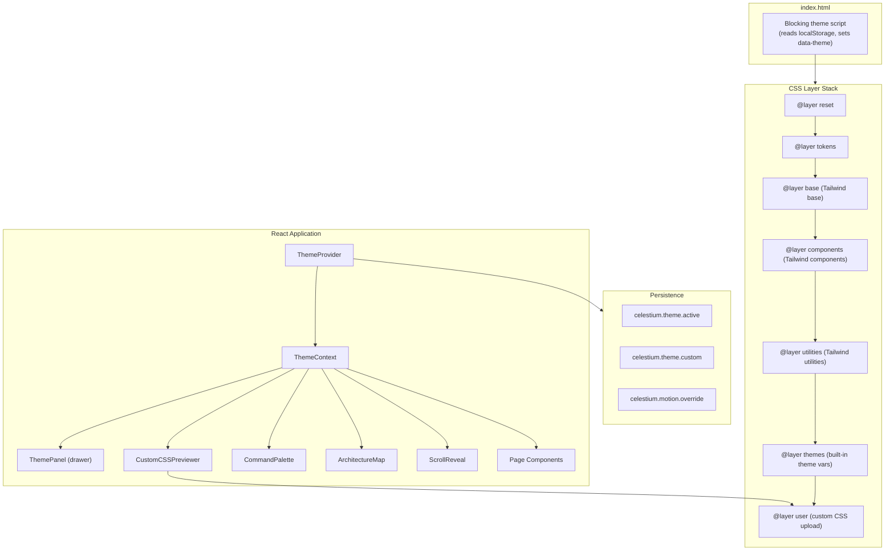

# Design Document: Serverless Site Facelift Theme Engine

## Overview

This design transforms the public website (`frontend/public-website/`) from a basic CMS frontend into a polished serverless engineering showcase with a runtime-configurable theme engine. The system replaces the current `!important`-heavy theme CSS overrides with a CSS custom properties pipeline consumed through Tailwind's config, enabling instant theme switching, five curated built-in themes, custom CSS upload with safety validation, and interactive mechanics (command palette, architecture map, scroll reveals).

The architecture follows a layered approach: a typed token schema defines all visual properties, CSS `@layer` ordering prevents specificity conflicts, a React context manages runtime state, and localStorage provides persistence. The site remains static (Vite SPA deployed to S3/CloudFront) with no server-side rendering requirements.

### Key Design Decisions

1. **Tailwind + CSS custom properties hybrid** — Tailwind config references CSS variables for colors/spacing, giving us utility ergonomics with runtime theming. No `!important` overrides needed.
2. **Blocking head script for FOUC prevention** — A small inline script in `index.html` reads localStorage and sets `data-theme` before first paint.
3. **CSS validation via csstree parser** — Rather than regex-based rejection, we parse uploaded CSS into an AST and apply an allowlist. This is the only robust approach for arbitrary CSS.
4. **Architecture map as React components (not raw SVG)** — Typed nodes/edges render as SVG via React, enabling keyboard navigation, state management, and accessibility without a separate SVG editing pipeline.
5. **No new heavy dependencies** — fast-check already present for PBT; we add only csstree (~30KB gzipped) for CSS parsing. Command palette, scroll reveals, and theme engine are all custom implementations.

---

## Architecture



### CSS Layer Stack

```css
@layer reset, tokens, base, components, utilities, themes, user;
```

| Layer | Purpose | Source |
|-------|---------|--------|
| `reset` | Browser normalization | Custom minimal reset |
| `tokens` | Default token values (`:root` custom properties) | `tokens.css` |
| `base` | Tailwind `@tailwind base` + semantic HTML styles | Tailwind + custom |
| `components` | Tailwind `@tailwind components` + component classes | Tailwind + custom |
| `utilities` | Tailwind `@tailwind utilities` | Tailwind |
| `themes` | `[data-theme="X"]` variable overrides | Built-in theme files |
| `user` | Custom uploaded CSS (scoped) | Runtime injection |

Tailwind's build-time `@layer` directives map to these native cascade layers via PostCSS configuration. The `themes` layer only redefines CSS custom property values — it never targets Tailwind utility classes directly.

---

## Components and Interfaces

### ThemeToken TypeScript Interface

```typescript
/** Core token categories for the theme system */
export interface ThemeTokens {
  /** Metadata */
  id: string;
  name: string;
  description: string;

  /** Colors — stored as space-separated RGB channels for Tailwind alpha support */
  colors: {
    primary: string;         // e.g., "99 102 241"
    primaryHover: string;
    secondary: string;
    background: string;
    backgroundAlt: string;
    surface: string;
    surfaceAlt: string;
    text: string;
    textMuted: string;
    textInverse: string;
    border: string;
    borderLight: string;
    accent: string;
    success: string;
    warning: string;
    error: string;
    info: string;
  };

  /** Typography */
  typography: {
    fontFamily: string;          // CSS font-family value
    fontFamilyMono: string;
    fontSizeBase: string;        // rem value
    fontSizeScale: number;       // typographic scale ratio (e.g., 1.25)
    lineHeight: string;
    fontWeightNormal: number;
    fontWeightBold: number;
  };

  /** Border radius */
  radius: {
    sm: string;
    md: string;
    lg: string;
    full: string;
  };

  /** Shadows */
  shadow: {
    sm: string;
    md: string;
    lg: string;
    glow: string;   // theme-specific glow effect
  };

  /** Motion */
  motion: {
    durationFast: string;    // e.g., "150ms"
    durationNormal: string;  // e.g., "300ms"
    durationSlow: string;    // e.g., "500ms"
    easing: string;          // CSS easing function
    reducedMotion: boolean;  // override for prefers-reduced-motion
  };

  /** Background patterns (optional) */
  patterns?: {
    type: 'none' | 'grid' | 'dots' | 'circuit' | 'scanlines' | 'noise';
    opacity: number;         // 0-1
    color: string;           // CSS color value
  };
}

/** Validation result */
export interface TokenValidationResult {
  valid: boolean;
  errors: Array<{ path: string; message: string }>;
  warnings: Array<{ path: string; message: string }>;
}
```

### ThemeProvider Context

```typescript
export interface ThemeContextValue {
  /** Current active theme ID */
  activeTheme: string;
  /** Full token set for the active theme */
  tokens: ThemeTokens;
  /** All available built-in themes */
  builtinThemes: ThemeTokens[];
  /** Custom theme (if loaded from localStorage or import) */
  customTheme: ThemeTokens | null;
  /** Whether a custom CSS preview is active */
  isPreviewActive: boolean;
  /** Switch to a built-in theme */
  setTheme: (themeId: string) => void;
  /** Apply a custom theme from tokens */
  applyCustomTheme: (tokens: ThemeTokens) => void;
  /** Export current tokens as JSON */
  exportTheme: () => void;
  /** Import tokens from JSON, returns validation result */
  importTheme: (json: string) => TokenValidationResult;
  /** Preview custom CSS (injected into user layer) */
  previewCSS: (css: string) => void;
  /** Save previewed CSS to localStorage */
  saveCustomCSS: () => void;
  /** Dismiss CSS preview without saving */
  dismissPreview: () => void;
  /** User's motion preference override */
  motionOverride: 'system' | 'reduce' | 'no-preference';
  setMotionOverride: (pref: 'system' | 'reduce' | 'no-preference') => void;
}
```

### Component Hierarchy

```
App
├── ThemeProvider
│   ├── Layout
│   │   ├── Header (nav, theme toggle button, command palette trigger)
│   │   ├── main
│   │   │   ├── HomePage
│   │   │   │   ├── HeroSection
│   │   │   │   ├── ArchitectureMapSection
│   │   │   │   ├── CapabilityCards
│   │   │   │   ├── MechanicsShowcase
│   │   │   │   ├── ThemeLabSection (inline theme preview)
│   │   │   │   ├── ProjectsSection
│   │   │   │   └── ContactSection
│   │   │   └── [other pages...]
│   │   └── Footer
│   ├── ThemePanel (side drawer / bottom sheet)
│   │   ├── ThemeCard[] (built-in theme swatches)
│   │   ├── JSONImportControl
│   │   ├── JSONExportButton
│   │   ├── CSSUploadControl
│   │   └── MotionPreferenceToggle
│   ├── CommandPalette (modal overlay)
│   │   ├── SearchInput
│   │   └── ResultsList
│   ├── CustomCSSPreviewIndicator (fixed badge)
│   └── ScrollRevealObserver (global IntersectionObserver manager)
```

### Architecture Map Data Model

```typescript
/** Node types in the architecture diagram */
export type NodeType =
  | 'client'
  | 'cdn'
  | 'api-gateway'
  | 'lambda'
  | 'database'
  | 'storage'
  | 'auth'
  | 'monitoring'
  | 'ci-cd';

export interface ArchNode {
  id: string;
  type: NodeType;
  label: string;
  /** Short explanation for non-technical mode */
  descriptionSimple: string;
  /** Detailed explanation for technical mode */
  descriptionTechnical: string;
  /** Position as percentage of container (0-100) */
  x: number;
  y: number;
  /** Icon identifier (maps to inline SVG) */
  icon: string;
}

export interface ArchEdge {
  id: string;
  from: string;    // node ID
  to: string;      // node ID
  label?: string;  // e.g., "HTTPS", "DynamoDB Streams"
  style: 'solid' | 'dashed' | 'animated';
}

export interface ArchitectureMapData {
  nodes: ArchNode[];
  edges: ArchEdge[];
}
```

### Command Palette Action Registry

```typescript
export interface PaletteAction {
  id: string;
  title: string;
  /** Searchable keywords */
  keywords: string[];
  /** Category for grouping */
  category: 'navigation' | 'theme' | 'action';
  /** Icon identifier */
  icon?: string;
  /** Keyboard shortcut hint */
  shortcut?: string;
  /** Action to execute */
  execute: () => void;
}

export interface CommandPaletteState {
  isOpen: boolean;
  query: string;
  results: PaletteAction[];
  selectedIndex: number;
}
```

---

## Data Models

### Built-in Themes Registry

```typescript
export const BUILTIN_THEMES: ThemeTokens[] = [
  {
    id: 'celestium-neon',
    name: 'Celestium Neon',
    description: 'Dark cyberpunk aesthetic with neon accents and glow effects',
    colors: {
      primary: '139 92 246',       // violet-500
      primaryHover: '124 58 237',  // violet-600
      secondary: '236 72 153',     // pink-500
      background: '3 7 18',        // near-black
      backgroundAlt: '15 23 42',   // slate-900
      surface: '30 41 59',         // slate-800
      surfaceAlt: '51 65 85',      // slate-700
      text: '248 250 252',         // slate-50
      textMuted: '148 163 184',    // slate-400
      textInverse: '15 23 42',
      border: '71 85 105',         // slate-600
      borderLight: '100 116 139',
      accent: '34 211 238',        // cyan-400
      success: '52 211 153',
      warning: '251 191 36',
      error: '248 113 113',
      info: '96 165 250',
    },
    typography: {
      fontFamily: '"Inter", system-ui, sans-serif',
      fontFamilyMono: '"JetBrains Mono", "Fira Code", monospace',
      fontSizeBase: '1rem',
      fontSizeScale: 1.25,
      lineHeight: '1.6',
      fontWeightNormal: 400,
      fontWeightBold: 700,
    },
    radius: { sm: '0.375rem', md: '0.5rem', lg: '0.75rem', full: '9999px' },
    shadow: {
      sm: '0 1px 3px rgba(139, 92, 246, 0.1)',
      md: '0 4px 12px rgba(139, 92, 246, 0.15)',
      lg: '0 12px 40px rgba(139, 92, 246, 0.2)',
      glow: '0 0 20px rgba(139, 92, 246, 0.4)',
    },
    motion: {
      durationFast: '150ms',
      durationNormal: '300ms',
      durationSlow: '600ms',
      easing: 'cubic-bezier(0.4, 0, 0.2, 1)',
      reducedMotion: false,
    },
    patterns: { type: 'grid', opacity: 0.05, color: 'rgba(139, 92, 246, 0.3)' },
  },
  // ... (other themes follow same structure)
];
```

The remaining four themes (`aws-console-after-dark`, `glass-circuit`, `paper-systems`, `terminal-witchcraft`) follow the same `ThemeTokens` structure with values appropriate to their aesthetic.

### localStorage Persistence Schema

| Key | Value Type | Purpose |
|-----|-----------|---------|
| `celestium.theme.active` | `string` (theme ID) | Active theme identifier |
| `celestium.theme.custom` | `string` (JSON) | Serialized custom `ThemeTokens` or raw CSS |
| `celestium.motion.override` | `'system' \| 'reduce' \| 'no-preference'` | Motion preference override |

### CSS Validation Rules

```typescript
export interface CSSValidationConfig {
  maxSizeBytes: number;          // 102400 (100KB)
  allowedMimeTypes: string[];    // ['text/css']
  blockedAtRules: string[];      // ['import', 'charset', 'namespace']
  blockedFunctions: string[];    // ['expression', '-moz-binding', 'behavior']
  blockedProtocols: string[];    // ['javascript', 'vbscript', 'data']
  allowedUrlDomains: string[];   // [] (no external URLs allowed)
  allowedProperties?: string[];  // undefined = all allowed except blocked
}
```

---

## Correctness Properties

*A property is a characteristic or behavior that should hold true across all valid executions of a system — essentially, a formal statement about what the system should do. Properties serve as the bridge between human-readable specifications and machine-verifiable correctness guarantees.*

### Property 1: Theme token round-trip (export/import)

*For any* valid `ThemeTokens` object, exporting it to JSON and then importing that JSON SHALL produce a theme that is deeply equal to the original (modulo unknown keys being stripped).

**Validates: Requirements 18.5**

### Property 2: Token schema validation rejects invalid types

*For any* JSON object where at least one required token field has an invalid type (e.g., number where string expected, missing required key), the `validateTokens` function SHALL return `{ valid: false }` with at least one error entry identifying the invalid field.

**Validates: Requirements 3.3**

### Property 3: CSS validation rejects dangerous patterns

*For any* CSS string containing one or more blocked patterns (`@import`, external `url()`, `javascript:`, `expression()`, `-moz-binding`), the CSS validator SHALL reject the input and return a descriptive error.

**Validates: Requirements 7.3, 14.3**

### Property 4: Theme application produces valid custom properties

*For any* valid `ThemeTokens` object, applying it via `setTheme` SHALL result in all color tokens being set as CSS custom properties on the document element, and each property value SHALL be a valid space-separated RGB triplet matching the input tokens.

**Validates: Requirements 4.1, 4.2**

### Property 5: Unknown token keys are ignored on import

*For any* valid `ThemeTokens` JSON object extended with additional arbitrary keys, importing it SHALL apply only the recognized token values and silently discard the unknown keys without error.

**Validates: Requirements 18.3**

### Property 6: Fuzzy search returns relevant results

*For any* set of registered `PaletteAction` items and any search query that is a substring of at least one action's title or keywords, the command palette fuzzy filter SHALL include that action in the results.

**Validates: Requirements 10.3**

### Property 7: CSS size limit enforcement

*For any* string with byte length exceeding 102400, the CSS upload validator SHALL reject it before parsing.

**Validates: Requirements 7.2, 14.2**

### Property 8: Theme persistence round-trip via localStorage

*For any* valid theme ID from the built-in set, calling `setTheme(id)` then reading `localStorage.getItem('celestium.theme.active')` SHALL return the same theme ID. On page reload simulation, the ThemeProvider SHALL initialize with that stored theme.

**Validates: Requirements 4.3, 4.4, 17.1**

---

## Error Handling

### Theme System Errors

| Error Condition | Handling Strategy |
|----------------|-------------------|
| localStorage unavailable (private browsing, quota exceeded) | Catch in try/catch, fall back to system preference, operate without persistence (Req 17.4) |
| Stored theme ID doesn't match any known theme | Log warning, fall back to system color scheme preference (Req 17.5) |
| JSON import parse failure | Display user-facing error in ThemePanel with "Invalid JSON" message (Req 18.4) |
| JSON import validation failure (bad token types) | Display field-level errors identifying which tokens are invalid (Req 6.7) |
| CSS upload exceeds 100KB | Reject before processing, show file size error (Req 7.2) |
| CSS upload contains blocked patterns | Reject with specific pattern identified in error message (Req 7.3) |
| CSS file wrong MIME type | Reject with "Only .css files accepted" message (Req 7.1) |

### Component Error Boundaries

- `ArchitectureMap`: Catches rendering errors and displays the text-based fallback description
- `CommandPalette`: Catches action execution errors, displays toast notification, does not crash
- `ThemePanel`: Catches import/export errors, displays inline error messages
- `ScrollReveal`: If IntersectionObserver is unavailable, renders all content immediately (no animation)

### Security Error Handling

- CSS parsing errors from csstree: Reject the entire file, display "CSS could not be parsed safely"
- Prototype pollution attempts in JSON: Use `JSON.parse` with no reviver, validate structure before spreading into state
- CSP violations from style injection: Use `<style>` element injection (not `style` attribute) which is compatible with `style-src 'unsafe-inline'` or nonce-based CSP

---

## Testing Strategy

### Property-Based Tests (using fast-check)

The project already has `fast-check@^4.8.0` as a dev dependency. Each correctness property maps to a property-based test with minimum 100 iterations.

| Property | Test File | Strategy |
|----------|-----------|----------|
| 1: Token round-trip | `src/test/theme-engine.property.test.ts` | Generate arbitrary valid ThemeTokens via custom Arbitrary, export→import→deepEqual |
| 2: Schema validation | `src/test/theme-engine.property.test.ts` | Generate tokens with random type corruption, assert validation catches it |
| 3: CSS rejection | `src/test/css-validator.property.test.ts` | Generate CSS strings with injected dangerous patterns at random positions |
| 4: Token application | `src/test/theme-engine.property.test.ts` | Generate valid tokens, apply, read computed CSS variables, compare |
| 5: Unknown key passthrough | `src/test/theme-engine.property.test.ts` | Extend valid tokens with random extra keys, import, verify only known keys applied |
| 6: Fuzzy search | `src/test/command-palette.property.test.ts` | Generate action sets + queries that are substrings, verify inclusion |
| 7: Size limit | `src/test/css-validator.property.test.ts` | Generate strings of random length, verify rejection threshold |
| 8: Persistence round-trip | `src/test/theme-engine.property.test.ts` | Generate theme IDs, set→read→verify from mock localStorage |

**Configuration:**
- Minimum 100 iterations per property test
- Tag format: `// Feature: serverless-site-facelift-theme-engine, Property N: <description>`

### Unit Tests (using Vitest + Testing Library)

- **ThemeProvider**: Initialization from localStorage, system preference fallback, setTheme behavior
- **Token validation**: Specific edge cases (empty object, null values, extra nesting)
- **CSS validator**: Known attack vectors (escaped characters, unicode sequences, comment injection)
- **CommandPalette**: Keyboard navigation, focus trapping, action execution
- **ScrollReveal**: IntersectionObserver callback behavior, reduced-motion bypass
- **ArchitectureMap**: Keyboard navigation between nodes, tooltip display, mode toggle

### Integration Tests

- Full theme switch lifecycle: click panel → select theme → verify DOM updates → verify localStorage
- CSS upload flow: select file → validate → preview → verify style injection → dismiss/save
- Command palette: open → type → select → verify navigation occurred
- Accessibility: axe-core automated checks on all themes for contrast ratios

### Performance Tests

- Bundle size regression: CI check that gzipped JS doesn't exceed baseline + 50KB
- LCP measurement: Lighthouse CI on the homepage hero section
- Theme switch timing: Measure time from click to all CSS variables updated (target: <16ms / single frame)

---

## Performance Strategy

### Code Splitting

```typescript
// Lazy-loaded components (not needed for initial render)
const ThemePanel = lazy(() => import('./components/ThemePanel'));
const CommandPalette = lazy(() => import('./components/CommandPalette'));
const ArchitectureMap = lazy(() => import('./components/ArchitectureMap'));
const CSSValidator = lazy(() => import('./utils/cssValidator'));
```

### Font Loading

```css
@font-face {
  font-family: 'Inter';
  src: url('/fonts/Inter-Variable.woff2') format('woff2');
  font-display: swap;
  font-weight: 100 900;
}
```

System font fallback stack ensures text is immediately visible while custom fonts load.

### Critical Path Optimization

1. **Blocking theme script** (~200 bytes inline) — prevents FOUC
2. **Critical CSS inlined** — tokens layer + active theme variables
3. **Tailwind purge** — already configured, removes unused utilities
4. **Dynamic imports** — ThemePanel, CommandPalette, ArchitectureMap load on demand
5. **IntersectionObserver** for below-fold content — ArchitectureMap, ScrollReveal sections
6. **SVG sprites** — architecture node icons as inline SVG, no network requests
7. **Image optimization** — no raster images in theme system; hero uses CSS gradients/patterns

### Bundle Budget

| Chunk | Max Size (gzipped) |
|-------|-------------------|
| Core (ThemeProvider + tokens + app shell) | 45KB |
| ThemePanel | 12KB |
| CommandPalette | 8KB |
| ArchitectureMap | 15KB |
| CSS Validator (csstree) | 30KB |
| Total additional vs current | < 50KB |

---

## Security Model

### CSS Upload Pipeline

```
User selects .css file
  → Check MIME type (text/css only)
  → Check file size (≤ 100KB)
  → Read as text
  → Parse with csstree into AST
  → Walk AST:
      ✗ Reject @import rules
      ✗ Reject url() with external domains
      ✗ Reject javascript:/vbscript:/data: protocols
      ✗ Reject expression() function
      ✗ Reject -moz-binding property
      ✗ Reject behavior property
  → If valid: inject into <style data-custom-css-preview> scoped to @layer user
  → If invalid: display specific error, no injection
```

### JSON Import Pipeline

```
User selects .json file
  → Parse with JSON.parse (try/catch)
  → Validate structure against ThemeTokens interface:
      ✓ All required fields present
      ✓ All field types correct
      ✓ Color values are valid RGB triplets
      ✓ Numeric values within expected ranges
  → Strip unknown keys (no prototype pollution vector)
  → If valid: apply as custom theme
  → If invalid: display field-level errors
```

### CSP Compatibility

The theme engine injects styles via `<style>` elements (not inline `style` attributes). For strict CSP environments:
- Theme CSS files are static assets (same-origin, CSP-safe)
- Custom CSS preview uses a managed `<style>` element — requires `style-src 'unsafe-inline'` or a nonce
- The blocking head script requires `script-src 'unsafe-inline'` or a hash/nonce in CSP headers
- Recommended CSP header addition: `style-src 'self' 'unsafe-inline'; script-src 'self' 'sha256-<hash>'`

### Input Boundaries

- Theme IDs: alphanumeric + hyphens only, validated against known set
- Token values: type-checked, no HTML/JS injection possible (CSS values only)
- CSS content: AST-parsed and allowlisted
- localStorage: all reads wrapped in try/catch, all values treated as untrusted on read

